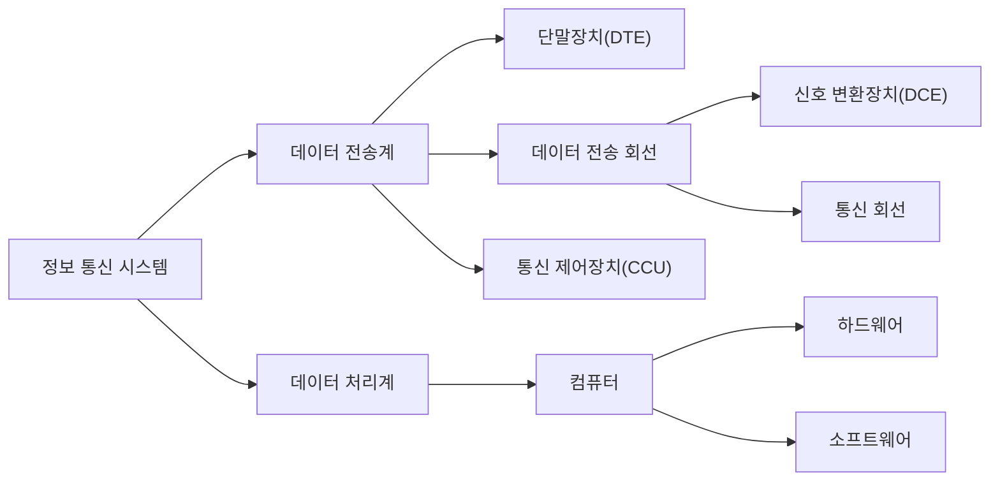
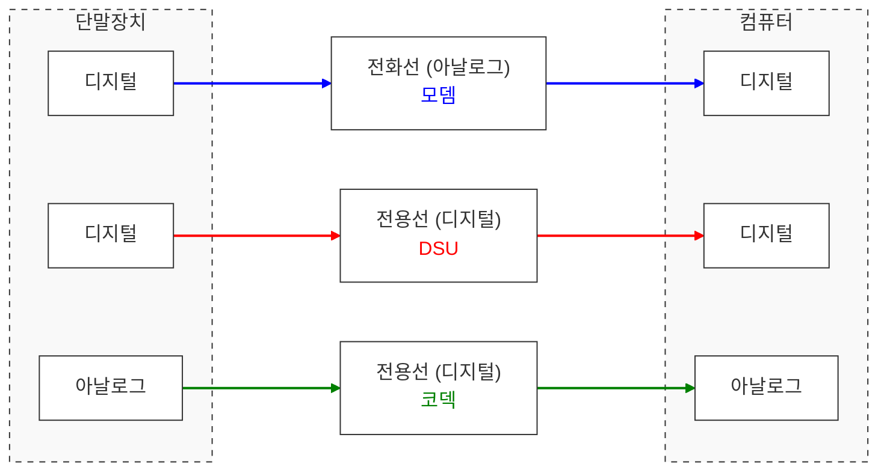
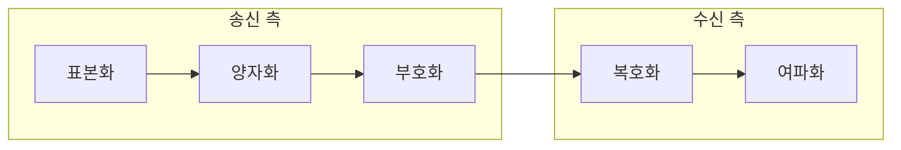
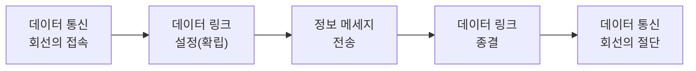

# 네트워크 개론

# 네트워크 기초 및 물리 계층

## 정보 통신 시스템의 구조

### **단말장치 (DTE, Data Terminal Equipment)**

통신 시스템과 사용자의 접점에 위치하여 컴퓨터(Host)에 의해 처리될 데이터를 입력하거나 처리된 결과를 출력하는 최종 장치

## 신호 변환 장치와 인터페이격

### **신호 변환 장치**

컴퓨터나 단말장치의 데이터를 통신회선에 적합한 신호로 변경하거나 통신회선의 신호를 컴퓨터나 단말장치에 적합한 데이터로 변환하는 신호 변환 기능을 수행

전송 회선의 양 끝단에 위치하므로 데이터 회선 종단장치(DCE, Data Circuitterminal)라고도 함.

변조: 원래 신호를 다른 신호로 변환 

복조: 변조된 신호를 원래 신호로 변환 

**모뎀(modem)**

- 컴퓨터나 단말장치로부터 전송되는 디지털 데이터를 아날로그 회선에 적합한 아날로그 신호로 변조(MODulation) 과정과 그 반대의 복조(DEModulation) 과정을 수행
- 디지털 데이터를 공중 전화 교환망(PSTN)과 같은 아날로그 통신망을 이용하여 전송할 때 사용
- 기능: 변·복조 기능, 자동 응답 기능, 반복 호출 기능, 자동 속도 조절 기능, 모뎀 시험 기능

**DSU (Digital Service Unit)**

- 컴퓨터나 단말장치로부터 전송되는 디지털 데이터를 디지털 회선에 적합한 디지털 신호로 변환하는 과정과 그 반대의 과정을 수행
- 신호의 변조 과정이 없이 단순히 유니폴라(단극성) 신호를 바이폴라(양극성) 신호로 변환하여 전달하는 기능만 제공하여 모델에 비해 단순한 구조
- 디지털 데이터를 공중 데이터 교환망(PSDN)과 같은 디지털 통신망을 이용하여 전송 할 때 사용
- 송 · 수신 기능과 타이밍 회복 기능을 DSU 자체에서 수행
- 속도가 빠르고 오류율이 낮다.

**코덱 (CODEC)**

- 아날로그 데이터를 디지털 통신 회선에 적합한 디지털 신호로 변환하는 변조 과정과 그 반대의 복조 과정을 수행
- 펄스 코드 변조(PCM) 방식을 이용하여 데이터를 변환

### DTE / DCE 접속 규격

단말장치(DTE)와 회선 종단장치(DCE) 간의 접속을 정확하게 수행하기 위한 기계적, 전기적, 물리적, 논리적 조건을 사전에 정의한 규격, OSI 참조 모델의 물리 계층에 관계됨.

**ITU-T**

- V 시리즈
    - 공중 전화 교환망(PSTN)을 통한 DTE / DCE 접속 규격
    - V.24 : 기능적, 절차적 조건에 대한 규정
    - V.28 : 전기적 조건에 대한 규정
- X 시리즈
    - 공중 데이터 교환망(PSDN)을 통한 DTE / DCE 접속 규격
    - X.20 : 비동기식 전송을 위한 DTE / DCE 접속 규격
    - X.21 : 동기식 전송을 위한 DTE / DCE 접속 규격
    - X.24 : DTE / DCE 간의 상호 접속 회로에 대한 규격
    - X.25 : 패킷 전송을 위한 DTE / DCE 접속 규격

**EIA**

- RS-232C
    - 공중 전화 교환망(PSTN)을 통한 DTE / DCE 접속 규격
    - V.24, V.28, ISO2110을 사용하는 접속 규격과 기능적으로 호환성을 가지며 현재 가장 많이 사용됨
    - 25핀으로 구성된 커넥터이며 전송 거리는 15m 이하
    - 데이터 신호 속도는 최고 20Kbps
    - 전이중 / 반이중, 동기 / 비동기 모두 대응 가능
- RS-449
    - 고속 데이터 통신을 위한 DTE / DCE 접속 규격
    - RS-232C의 단점을 반례 위한 새로운 표준
    - 거리에 제한이 없고 RS-232C에 비해 빠른 속도

## 전송 매체 및 다중화 기술

### 다중화기 (MUX, Multiplexer)

하나의 통신 회신에 복수의 단말장치가 동시에 접속하여 사용될 수 있도록 하는 장치

**주파수 분할 다중화기 (FDM, Frequency Division Mulitiplexer)**

통신 회선의 주파수를 여러 개로 분할하여 복수의 단말기가 동시에 사용할 수 있도록 한 것

- 전송 신호에 필요한 대역폭보다 전송 매체의 유효 대역폭이 큰 경우에 사용
- 다중화기 자체에 변 · 복조 기능이 내장되어 있어 모뎀 설치 불필요
- 시분할 다중화기에 비해 간단한 구조와 저렴한 비용
- 대역폭을 나누어 사용하는 각 채널들 간 상호 간섭을 방지하기 위한 보호 대역(Guard Band) 필요
- 보호 대역 사용으로 인한 대역폭 낭비 초래
- 저속(1,200bps 이하)이며, 비동기식 전송으로만 이용
- 멀티 포인트(Mulit-Point) 방식, 아날로그 신호 전송에 적합

**시분할 다중화기(TDM, Time Division Multiplexer)**

통신 회선의 대역폭을 일정한 시간 폭(Time Slot)으로 나누어 복수의 단말장치가 사용할 수 있도록 한 것

- 디지털 회선에서 주로 이용하며 대부분의 데이터 통신에 사용
- 대역폭(BandWidth)의 이용도가 높아 고속 전송에 용이
- 시분할 다중화기에는 동기식 시분할 다중화기와 비동기식 시분할 다중화기가 있다.
- 동기식 다중화기 (STDM, Synchronous TDM)
    - 일반적인 다중화기. 모든 단말장치에 균등한(고정된) 시간폭(Time Slot)을 제공
    - 다중화기의 내부 속도와 단말장치의 속도 차이를 보완해 주는 버퍼 필요
    - 전송할 데이터가 없어도 시간폭(Time Slot)이 제공되므로 효율성 저하
- 비동기식 다중화기 (ATDM, Asynchronous TDM)
    - 마이크로프로세서를 이용하여 접속된 단말장치 중 전송할 데이터가 있는 단말장치에만 시간폭(Time Slot)을 제공
    - 다중화기의 내부 속도와 단말장치의 속도 차이를 보완해 주는 버퍼 필요
    - 데이터 전송랭이 많아질 경우 전송 지연 발생 가능
    - a.k.a 지능 다중화기, 확률적 다중화기, 통계적 다중화기

### 광섬유 케이블 (Optical Fiber Cable)

유리를 원료로 하여 제작된 가느다란 광섬유를 여러 가닥 묶어서 케이블의 형태로 만든 것. a.k.a. 광 케이블

- 데이터를 빛으로 바꾸어 빛의 반사(전반사) 원리를 이용하여 전송
- 유선 매체 중 가장 빠른 속도와 높은 주파수 대역폭을 제공
- 대용량, 장거리 전송이 가능
- 도청이 어려워 보안성 우수
- 저손실성, 무누화의 성질
- 무유도 성질이므로 전자기적 잡음에 강함
- 감쇠율이 적어 리피터의 설치 간격이 넓으므로 리피터의 소요가 적음
- 온도 변화에 안정적이고 신뢰성이 높음
- 설치 비용은 비싸지만 단위 비용은 저렴함
- 광섬유 간의 연결이 어려워 설치 시 고도의 기술 필요

**광섬유 케이블의 전송 모드**

단일 모드, 계단형 다중 모드, 언덕형 다중 모드

**광섬유 케이블의 구성**

- 코어 (Core) : 빛이 전파되는 영역, 클래드보다 높은 굴절률
- 클래드 (Clad) : 코어보다 굴절률이 약간 낮아 코어의 빛을 반사시켜 외부로 빠져나가지 못하게 하고, 코어를 외부의 압력으로부터 보호
- 재킷 (Jacket) : 습기, 마모, 파손 등의 위험으로부터 내부를 보호

# 전송 속도 및 신호 변술

## 통신 속도와 채널 용량

### 변조 속도와 데이터 신호 속도

**변조 속도**

1초 동안 몇 개의 신호 변화가 있었는가를 표현하며 단위는 baud

1개의 신호가 변조되는 시간을 T초라 할 때 변조 속도는 baud = 1 / T

**신호 속도**

데이터 신호 속도는 다음과 같이 구함

- 데이터 신호 속도(bps) = 변조 속도(baud) x 변조 시 상태 변화 수

데이터 신호 속도의 계산식에 의해 변조 속도를 다음과 같이 구함

- 변조 속도(baud) = 데이터 신호 속도(bps) / 변조 시 상태 변화 수

**변조 시 상태 변화 수**

모노비트 (Monobit)

디비트 (Dibit)

트리비트 (Tribit)

쿼드비트 (Quadbit)

= 2위상 (2진)

= 4위상 (3진)

= 8위상 (8진)

= 16위상 (16진)

= 1bit

= 2bit

= 3bit

= 4bit

### 통신용량

단위 시간 동안 전송 회선이 최대로 통신할 수 있는 통신 전송량

**샤논(Shannon)의 정의**

잡음 여부에 따라 두 가지로 통신 용량을 정의

<aside>

**잡음이 있는 경우**

$$
C = W * log_2(1+S/N)[bps]

$$

C : 통신 용량, W : 대역폭, S : 신호 전력, N : 잡음 전력

</aside>

<aside>

**잡음이 없는 경우**

$$
C = 2Blog_2(M)

$$

C : 통신 용량, B : 대역폭, M : 신호 레벨

</aside>

**전송로의 통신 용량을 늘리기 위한 방법**

- 주파수 대역폭을 늘린다.
- 신호 세력을 높인다.
- 잡음 세력을 줄인다.

## 신호 변조 및 디지털화 기술

### 디지털 변조

디지털 데이터를 아날로그 신호로 변환하는 것을 의미하며 모뎀을 이용

디저털 변조 방식에는 진폭 편이 변조(ASK), 주파수 편이 변조(FSK), 위상 편이 변조(PSK), 직교 진폭 변조(QAM)이 있다.

**진폭 편이 변조(ASK)**

- 2진수 0과 1을 서로 다른 진폭의 신호로 변조
- 신호 변동과 잡음에 약하여 데이터 전송용으로 거의 사용되지 않음

**주파수 편이 변조(FSK)**

- 2진수 0과 1을 서로 다른 주파수로 변조
- 1,200Bps 이하의 저속도 비동기식 모뎀에서 사용

**위상 편이 변조(PSK)**

- 2진수 0과 1을 서로 다른 위상을 갖는 신호로 변조
- 한 위상에 1비트(2위상), 2비트(4위상), 또는  3비트(8위상)를 대응시켜 전송하므로 속도를 높일 수 있다.
- 중 · 고속의 동기식 모뎀에 많이 사용
- 반송파 간의 위상차 : 2π / M (M은 위상)

**직교 진폭 변조(QAM)**

- a.k.a. 진폭 위상 변조, 직교 위상 변조
- 반송파의 진폭과 위상을 상호 변환하여 신호를 얻는 변조 방식
- 고속 전송 가능, 9,600Bps 모뎀의 표준 방식으로 권고

### 펄스 코드 변조(PCM, Pulse Code Modulation)

화상, 음성, 동영상 비디오, 가상 현실 등과 같이 연속적인 시간과 진폭을 가진 아날로그 데이터를 디지털 신호로 변환하는 것으로 코덱을 이용

펄스 코드 변조는 송신 측에서 아날로그 데이터를 표본화하여 PAM 신호로 만든 후 양자화, 부호화 단계를 거쳐 디지털 형태(2진수)로 전송하는 방식

**펄스 코드 변조 순서**

**표본화 (Sampling)**

- 음성, 영상 등의 연속적인 신호 파형을 일정 시간 간격으로 검출하는 단계
- 샤논의 표본화 이론: 어떤 신호 f(t)가 의미를 지니는 최고 주파수보다 2배 이상의 주파수로 균일한 시간 간격 동안 채집된다면 이 채집된 데이터는 원래의 신호가 가진 모든 정보를 포함
- 표본화에 의해 검출된 신호를 PAM 신호라 하며 아날로그 형태
- 표본화 횟수 = 2배 x 최고 주파수
- 표본화 간격 = 1 / 표본화 횟수

**양자화 (Quantizing)**

- 표본화된 PAM 신호를 유한 개의 부호에 대한 대표값으로 조정하는 과정
- 실수 형태의 PAM 신호를 반올림하여 정수형으로 변환
- 양자화 잡음 : 표본 측정값과 양자화 파형과의 오차, 주로 PCM 단국장치에서 발생
- 양자화 잡음은 양자화 레벨을 세분화하여 줄일 수 있으나 데이턴의 양이 많아지고 전송 효율 저하
- 양자화 레벨
    - PAM 신호를 부호화할 때 2진수로 표현할 수 있는 레벨
    - 양자화 레벨 = 2^표본당 전송 비트 수

**부호화 (Encoding)**

- 양자화된 PCM 펄스이 진폭 크기를 2진수(1 또는 0)로 표시하는 과정

**복호화 (Decoding)**

- 수신된 디지털 신호(PCM 신호)를 PAM 신호로 복원하는 과정으로 복호기(Decoder)를 이용해 복원

**여과화(Filtering)**

- PAM 신호를 원본 입력 신호인 아날로그 신호로 복원하는 과정

# 데이터 링크 계층과 전송 제어

## 데이터 전송 방식과 동기화

### **통신 방식**

데이터의 전송 방향에 따라 단방향 통신과 양방향 통신으로 구분되며 양방향 통신은 반이중 통신과 전이중 통신으로 구분

**단방향(Simple) 통신**

- 한 방향으로만 전송이 가능한 방식
- ex) 라디오, TV

**반이중(Half-Duplex) 통신**

- 양방향으로 전송이 가능하나 동시에 양방향에서 전송할 수는 없는 방식
- 2선식 선로를 사용하여 송신과 수신을 번갈아 전송
- ex) 무전기, 모뎀을 이용한 데이터 통신

**전이중(Full-Duplex) 통신**

- 동시에 양방향 전송이 가능한 방식
- 4선식 선로를 사용, 주파수 분할 이용 시 2선식도 가능
- 전송량이 많고 전송 매체의 용량이 클 때 사용
- ex) 전화, 전용선을 이용한 데이터 통신

### **동기식 / 비동기식 전송**

**동기식 전송**

미리 정해신 수만큼의 문자열을 한 블록(프레임)으로 만들어 일시에 전송하는 방식

- 블록과 블록 사이에는 휴지 시간(Idle Time)이 없다.
- 프레임 단위로 전송 → 빠른 전송 속도
- 시작 / 종료 비트로 인한 오버헤드가 없고 휴지 시간이 없어 높은 전송 효율
- 원거리 전송에 주로 사용
- 단말기는 버퍼 기억장치 내장 필수
- **프레임(Frame)**
    - 전송할 자료를 일정한 크기로 분리한 것. 동기식 전송의 전송 단위.
    - 데이터뿐만 아니라 행선지 코드, 동기를 위한 제어 문자, 오류 검출을 위한 패리티나 CRC 등의 추가 정보로 구성

**비동기식 전송**

한 문자를 나타내는 부호(문자 코드) 앞뒤에 시작 비트(Start Bit)와 정지 비트(Stop Bit)를 붙여 각 바이트(Byte) 별로 구별하여 전송하는 방식

- 시작 비트, 전송 문자(정보 비트), 정지 비트로 구성된 한 문자를 단위로 하여 전송. 오류 검출을 위한 패리티 비트(Parity Bit) 추가하는 경우 有
- 문자와 문자 사이의 휴지 시간(Idle Time)이 불규칙적
- 한 번에 많은 데이터 전송 시 프레이밍 에러(Framing Error) 가능성 증가
- 2,000bps(약 2kbps) 이하의 저속, 단거리 전송에 사용
- 동기화 단순. 저렴한 가격
- 문자마다 시작과 정지를 알리기 위한 비트가 2~3비트씩 추가 → 전송 효율 저하

## 전송 제어 절차와 오류 제어

### 전송 제어 (Transmission Control)

정확하고 원활한 데이터의 흐름을 위해 입·출력 제어, 회선 제어, 동기 제어, 오류 제어, 흐름 제어 등을 총괄하여 수행하는 것

- 0SI 7 참조 모델의 데이터 링크 계층(2계층)에서 수행되는 기능
- 전송 제어에 사용되는 프로토콜을 전송 제어 프로토콜 또는 링크째 프로토콜이라 함
- 전송 제어 절차 5단계

### **고급 데이터 링크 제어 (**HDLC, **High-level Data Link Control)**

비트 위주의 프로토콜. 각 프레임에 데이터 흐름을 제어하고 오류를 보정할 수 있는 비트 열을 삽입하여 전송

- 포인트 투 포인트 및 멀티 포인트, 루프 방식에서 모두 사용 가능
- 단방향, 반이중, 전이중 통신을 모두 지원하며 동기식 전송 방식 사용
- 에러 제어를 위해 Go-Back-N ARQ와 선택적 재전송(Selective Repeat) ARQ를 사용
- 흐름 제어를 위해 슬라이딩 윈도우 방식을 사용
- 전송 제어상의 제한을 받지 않고 자유로이 비트 정보 전송 가능(비트 투과성)
- 높은 전송 효율과 신뢰성
- HDLC의 데이터 전송 모드 : 표준(정규) 응답 모드(NRN), 비동기 응답 모드(ARM), 비동기 균형(평형) 모드(ABM)

**프레임 구조**

- **플래그 (Flag)**
    - 프레임의 시작과 끝을 나타내는 고유한 비트 패턴(01111110)
    - 프레임의 시작과 끝을 구분, 동기 유지(통화로의 혼선 방지), 비트 투과성을 이용한 기본적인 오류 검출 등의 기능을 수행
- **주소부 (Address Field)**
    - 송•수신국을 식별하기 위해 사용
    - 모든 수신국에 전송되는 방송용은 11111111
    - 임의로 지정된 수신국에만 전송되는 시험용은 00000000
- **제어부 (Control Field)**
    - 프레임의 종류를 식별하기 위해 사용
    - 정보 프레임 (Informaion Frame) : 사용자 데이터를 전달
    - 감독 프레임 (Supervisory Frame) : 오류 제어와 흐름 제어를 수행
    - 비(무)번호 프레임 (Unnumber Frame) : 회선의 설정, 유지 및 종결 담당
- **정보부 (Information Field)**
    - 실제 정보 메시지가 담겨 있는 부분
- **FCS (프레임 검사 순서 필드)**
    - 프레임 내용에 대한 오류 검출을 위해 사용
    - 일반적으로 CRC 코드 사용

### 오류 발생의 원인

**감쇠 (Attenuation)**

- 전송 신호 세력이 전송 매체를 통과하는 과정에서 거리에 따라 약해지는 현상

**지연 왜곡 (Delay Distortion)**

- 하나의 전송 매체를 통해 여러 신호를 전달했을 때 주파수에 따라 그 속도가 달라짐으로써 발생하는 오류

**백색 잡음 (White Noise)**

- 전송 매체 내부에서 온도에 따라 전자의 운동량이 변화함으로써 발생하는 잡음.
- a.k.a 가우스 잡음, 열 잡음

**상호 변조(간섭) 잡음 (Intermodulation Noise)**

- 서로 다른 주파수들이 하나의 전송 매체를 공유할 때 주파수 간의 합이나 차로 인해 새로운 주파수가 생성되는 잡음

**누화 잡음 = 혼선 (Cross talk Noise)**

- 인접한 전송 매체의 전자기적 상호 유도 작용에 의해 생기는 잡음

**충격성 잡음 (Impulse Noise)**

- 번개와 같은 외부적인 충격 또는 통신 시스템의 결함이나 파손 등의 기계적인 충격에 의해 순간 발생하는 잡음
- 디지털 데이터를 전송하는 경우 중요한 오류 발생 요인

### 자동 반복 요청(ARQ, Automatic Repeat reQuest)

오류 발생 시 수신 측은 오류 발생을 송신 측에 통보하고 송신 측은 오류 발생 블록을 재전송하기까지의 모든 절차

**정지 - 대기 (Stop and Wait) ARQ**

- 송신 측에서 하나의 블록 전송 후 수신 측으로부터 응답을 기다리는 방식
- 구현 방법이 가장 단순하나 전송 효율이 떨어진다.

**연속 (Continuous) ARQ**

- 연속적으로 데이터 블록을 전송하는 방식
- **Go-Back-N ARQ** : 오류가 발생한 블록 이후의 모든 블록을 재전송하는 방식
- **선택적 재전송 (Selective Repeat) ARQ** : 오류가 발생한 블록만을 재전송하는 방식

**적응적 (Adaptive) ARQ**

- 블록 길이를 채널의 상태에 따라 그때 그때 동적으로 변경하는 방식
- 전송 효율이 가장 좋다.
- 제어 회로가 복잡하고 비용이 많이 들어 현재 거의 사용되지 않는다.

ACK - 긍정 응답  NAK - 부정 응답

### 오류 검출 방식

오류를 검출하는 가장 대표적인 방법은 오류 검출 코드를 이용

송신 측에서 전송 데이터에 오류 검출 코드를 부과하여 송신하면 수신 측에서는 그 코드를 이용하여 수신된 데이터의 오류를 검출

**패리티 검사 (Parity Check)**

- 데이터 블록에 1비트의 검사 비트인 패리티 비트를 추가하여 오류를 검출
- 가장 간단한 방식
- 2개의 비트에 오류 동시 발생 시 검출 불가능
- 오류 검출만 가능하나 수정은 불가능
- 홀수 / 짝수 수직 패리티 체크와 홀수 / 짝수 수평 패리티 체크
- 1인 비트 수에 따라 짝수 = 우수, 홀수 = 기수 구분
- 홀수 / 짝수로 데이터 전송 시 1인 비트 수가 홀수 / 짝수가 아니면 오류 출력

**해밍 코드 (Hamming Code)**

- 수신 측에서 오류가 발생한 비트를 검출한 후 직접 수정하는 전진(순방향) 오류 수정 방식으로 자기 정정 부호라고도 한다.
- 1비트의 오류만 수정 가능
- 정보 비트 외에 잉여 비트가 많이 필요
    - $2^p >= d + p + 1 ~(p : 패리티 비트 수, d : 데이터 비트 수)$
    - $p = min ( p ∈ ℕ : 2^p >= d + p + 1 )$
- 패리티 비트를 데이터의 비트 수에 따라 필요한만큼 사용하여 데이터에 추가하고, 패리티 비트를 조합하여 에러 검출 및 교정을 수행
- 전송 비트 중 1, 2, 4, 8, … , 2^n번째 자리는 오류 검출을 위한 패리티 비트로 사용

- 각 패리티 비트는 데이터 비트들의 특정 조합을 체크
- 데이터를 받는 쪽에서는 수신된 비트들을 가지고 다시 패리티 체크를 수행합니다. 이때 발생하는 값이 신드롬(Syndrome)
    1.  **패리티 체크 수행**
        - 각 패리티 그룹(P1, P2, P4)에 대해 짝수 패리티(혹은 홀수)가 맞는지 확인
    2. **결과 합산**
        - 오류가 없다면 결과값은 000
        - 오류가 있다면, 틀린 패리티 비트들의 위치 값을 합산
        - 예를 들어, P1과 P4에서 오류가 났다면 1 + 4 = 5이므로 5번째 비트에서 오류
    3. **비트 반전**
        - 찾아낸 위치의 비트를 0이면 1로, 1이면 0으로 XOR연산하여 수정

**순환 중복(잉여) 검사 (CRC)**

- 프레임 단위로 오류 검출을 위한 다항식 코드(FCS)를 사용하여 오류를 검출
- 전송 과정에서 오류 발생 시 송신 측에 재전송을 요구하는 후진(역방향) 오류 수정 방식
- 동기식 전송에 사용되는 에러 검출 기법으로 데이터가 프레임 단위로 전송 시에 사용되는 방식
- HDLC 프레임의 FCS(프레임 검사 순서 필드)를 만드는 방법으로 사용
- 집단 오류를 검출 가능
- 높은 검출률로 인해 가장 많이 사용

# 프로토콜과 네트워크 계층 구조

## 통신 프로토콜

### **프로토콜**

서로 다른 기기 간 원활한 데이터 교환의 수행을 위해 표준화 시킨 통신 규약

통신을 제어하기 위한 표준 규칙과 절차의 집합

ㄴ> 하드웨어와 소프트웨어, 문서를 모두 규정

- **구문 (Syntax)** : 전송하고자 하는 데이터의 형식, 부호화, 신호 레벨 등을 규정
- **의미 (Semantics)** : 두 기기 간의 효율적이고 정확한 정보 전송을 위한 협조 사항과 오류 관리를 위한 제어 정보 규정
- **시간 (Timing)** : 두 기기 간의 통신 속도, 메세지의 순서 제어 등을 규정

### 전송 방식

프로토콜은 전송하고자 하는 데이터 프레임의 구성에 따라 문자 방식, 바이트 방식, 비트 방식으로 구분 가능

**문자 전송 방식**

- 전송 제어 문자(SOH, STX, ETX, EOT 등)를 사용하여 데이터 프레임의 시작과 끝을 나타내는 방식
- 대표 프로토콜은 BSC

**바이트 방식**

- 데이터 프레임의 헤더(Header)에 전송 데이터 프레임의 문자 개수, 메시지 수신 상태 등의 제어 정보를 삽입하여 전송하는 방식
- 대표 프로토콜은 DDCM
- DDCM (Digital’s Data Communication Message) 프로토콜
    - 바이트 방식의 프로토콜
    - 전이중 •반이중 통신, 동기•비동기 전송을 지원
    - 포인트 투 포인트, 멀티 포인트 방식에서 사용 가능

**비트 방식**

- 데이터 프레임의 시작과 끝을 나타내는 고유한 비트 패턴(플래그)을 삽입하여 전송하는 방식
- 대표 프로토콜은 HDLC, SDLC, ADCCP
- ADCCP (Advanced Data Communication Procedures) 프로토콜
    - 미국표준협회(ANSI)에서 제정한 비트 방식의 프로토콜
    - 국제표준화협회(ISO)의 HDLC, IBM사의 SDLC와 연결 제어 방식이 거의 같은 절차로 수행

## OSI 7계층 참조 모델

다른 시스템 간의 원활한 통신을 위해 ISO(국제표준화기구)에서 제안한 통신 규약

- 개방형 시스템(Open System) 간의 데이터 통신 시 필요한 장비 및 처리 방법 등을 7단계로 표준화하여 규정
- 1~3 계층을 하위 계층, 4~7 계층을 상위 계층이라 지칭
    - 하위 계층 : 물리 계층 → 데이터 링크 계층 → 네트워크 계층
    - 상위 계층 : 전송 계층 → 세션 계층 → 표준 계층 → 응용 계층

### OSI 계층 구조

**물리 계층 (Physical Layer)**

전송에 필요한 두 장치 간 실제 접속과 절단 등 기계적, 전기적, 기능적, 절차적 특성에 대한 규칙을 정의

- 물리적 전송 매체와 전송 신호 방식을 정의
- RS-232C, X.21등의 표준 존재
- 관련 장비 : 리피터, 허브

**데이터 링크 계층 (Data Link Layer)**

두 개의 인접한 개방 시스템들 간에 신뢰성 있고 효율적인 정보 전송을 할 수 있도록 시스템 간 연결 설정과 유지 및 종료를 담당

- 송신 측과 수신 측의 속도 차이 해결을 위한 흐름 제어 기능
- 프레임의 시작과 끝을 구분하기 위한 프레임의 동기화 기능
- 오류의 검출과 회복을 위한 오류 제어 기능
- 프레임의 순서적 전송을 위한 순서 제어 기능
- HDLC, LAPB, LLC, MAC, LAPD, PPP 등의 표준 존재
- 관련 장비 : 랜카드, 브리지, 스위치
- **MAC (Media Access Control) 계층**
    - 물리적 매체 접근 방식을 제어
    - 물리 주소를 처리하고 물리 계층과 연결
- **LLC (Local Link Control) 계층**
    - 상위 계층과의 인터페이스 역할
    - 흐름 제어 및 오류 제어 기능을 제공

**네트워크 계층 (Network Layer, 망 계층)**

개방 시스템들 간의 네트워크 연결을 관리하는 기능과 데이터의 교환 및 중계 기능

- 네트워크 연결을 설정, 유지, 해제하는 기능
- 발신지와 목적지의 논리 주소가 추가된 패킷을 최종 목적지까지의 전달을 책임
- 경로 설정 (Routing), 데이터 교환 및 중계, 트래픽 제어, 패킷 정보 전송을 수행
- X.25, IP 등의 표준 존재
- 관련 장비 : 라우터

**전송 계층 (Transport Layer)**

논리적 안정과 균일한 데이터 전송 서비스를 제공함으로써 종단 시스템(End-to-End) 간에 투명한  데이터 전송을 가능케 한다.

- OSI 7계층 중 하위 3계층과 상위 3계층 간의 인터페이스(Interface)를 담당
- 종단 시스템(End-to-End)  간의 전송 연결 설정, 데이터 전송, 연결 해제 기능
- 주소 설정, 다중화 (분할 및 재조립), 오류 제어, 흐름 제어 수행
- TCP, UDP 등의 표준 존재
- 관련 장비 : 게이트웨이

**세션 계층 (Session Layer)**

송•수신 측 간의 관련성을 유지하고 대화 제어를 담당

- 대화(회화) 구성 및 동기 제어, 데이터 교환 관리 기능
- 송•수신 측 간의 데이터 전송, 연결 해제, 동기 처리 대화 관리를 위해 토큰 사용
- 송•수신 측 간의 대화 동기를 위해 전송하는 정보의 일정한 부분에 체크점을 두어 정보의 수신 상태를 체크하며 이 체크점을 동기점(Syncronization Point)이라 한다.
- 동기점은 오류가 있는 데이터의 회복을 위해 사용. 소동기점, 대동기점으로 분류
- **소동기점 (Minor Syncronization Point)**
    - 하나의 대화 단위 내에서 데이터의 전달을 제어하는 역할
    - 수신 측으로부터 확인 신호(ACK)를 받지 않는다.
- **대동기점 (Major Syncronization Point)**
    - 전송하는 각 데이터의 처음과 끝에 사용하여 전송하는 데이터 단위를 대화 단위로 구성하는 역할
    - 수신 측으로부터 반드시 전송한 데이터에 대한 확인 신호(ACK)를 받는다.

**표현 계층 (Presentation Layer)**

응용 계응으로부터 받은 데이터를 세션 계층에 보내기 전에 통신을 적당한 형태로 변환하고 세션 계층에서 받은 데이터는 응용 계층에 맞게 변환하는 기능

- 서로 다른 데이터 표현 형태를 갖는 시스템 간의 상호 접속을 위해 필요한 계층
- 코드 변환, 데이터 암호화, 데이터 압축, 구문 검색, 정보 형식(포맷) 변환, 문맥 관리 기능

**응용 계층 (Application Layer)**

사용자(응용 프로그램)가 OSI 환경에 접근 할 수 있도록 서비스를 제공

- 응용 프로세스 간의 정보 교환, 전자 사서함, 파일 전송, 가상 터미널 등의 서비스를 제공

## TCP/IP 모델과 주요 네트워크 프로토콜

### X.25 프로토콜

DTE와 DCE 간의 인테페이스를 제공하는 프로토콜

통신을 원하는 두 단말장치가 패킷 교환망을 통해 패킷을 원활히 전달하기 위한 통신을 규정

- ITU-T에서 제정(1976년 승인)한 국제 표준 프로토콜. 호환성 우수
- 강력한 오류 체크 기능으로 높은 신뢰성 보장
- 회선 하나에 장애가 발생해도 정상적인 경로를 선택하여 우회 전송 가능
- 디지털 전송을 기본으로 하므로 전송 품질이 우수
- 가상 회선 방식을 이용하나 하나의 물리적 회선에 다수의 논리을 채널 할당하여  효율성이 높다.
- 축적 교환 방식을 사용하므로 전송을 위한 처리 지연 발생 가능

**계층 구조**

**물리 계층**

- DTE와 DCE 간의 물리적 접속에 관한 인터페이스를 정의하는 계층
- X.21 사용

**프레임 계층**

- 패킷의 원활한 전송을 위해 데이터 링크의 제어를 수행하는 계층으로 링크 계층이라고도 한다.
- OSI 7계층의 데이터 링크 계층에 해당
- 전송 제어를 위해 HDLC 프로토콜의 변형인 LAPB 사용
- 다중화, 순서 제어, 오류 제어, 흐름 제어 기능 등을 수행

**패킷 계층**

- OSI 7계층 중 네트워크 계층에 해당
- **수행 절차** : 호 설정 (Call Setuo) → 데이터 전송 (Data Transfer) → 호 해제 (Call Cleaning)
- 데이터 전송 시 오류 제어, 순서 제어, 흐름 제어 등의 데이터 전송 제어 기능을 수행
- 호(Call) 설정 후 호(Call) 해제 시까지 가상 회선을 이용하여 통신 경로를 유지하므로 패킷을 마지막까지 안전하게 전송 가능

### TCP / IP (Transmission Control Protocol / Internet Protocol)

서로 다른 기종의 컴퓨터 간 데이터를 송•수신 할 수 있도록 하는 표준 프로토콜

**TCP**

- OSI 7계층의 전송 계층
- 신뢰성 있는 연결형 서비스 제공
- 패킷의 다중화, 순서 제어, 오류 제어, 흐름 제어 기능을 제공

**IP**

- OSI 7계층의 네트워크 계층
- 데이터그램을 기반으로하는 비연결형 서비스 제공
- 패킷의 분해/조립, 주소 지정, 경로 선택 기능 제공

**연결형(접속형) 통신** : 송•수신 측 간을 논리적으로 연결 후 데이터를 전송하는 방식. 가상 회선 방식

**비연결형(비접속) 통신** : 송•수신 측 간에 논리적 연결 없이 데이터를 전송하는 방식. 데이터그램 방식

### OSI 모델과 TCP/IP 모델의 계층 구조 비교

**응용 계층 (응용 계층, 표현 계층, 세션 계층)** 

- 응용 프로그램들 간의 데이터 송•수신 제공
- TELNET, FTP, SMTP, E-Mail 등

**전송 계층 (전송 계층)**

- 호스트들 간의 통신 제공
- TCP, UDP 등

**인터넷 계층 (네트워크 계층)**

- 데이터 전송을 위한 주소 지정, 경로 배정 제공
- IP, ICMP, IGMP, ARP, PARP 등

**네트워크 액세스 계층 (네트워크 링크 계층, 물리 계층)**

- 실제 데이터(프레임)을 송•수신하는 역할
- Ethernet, IEEE 802, HDLC, X.25, RS-232 등

### 주요 프로토콜

**FTP (File Transher Protocol)**

- 파일 전송 프로토콜

**SMTP (Simple Mail Transfer Protocol)**

- 전자 우편 전송을 위한 프로토콜

**TELNET**

- 가상 터미널 프로토콜

**SNMP (Simple Network Managment Protocol)**

- 간이 망 관리 프로토콜
- 라우터나 허브 등 네트워크 기기의 네트워크 정보를 네트워크 관리 시스템에 보내는 데 사용되는 표준 통신 규약

**UDP (User Datagram Protocol)**

- 데이터 전송 전에 연결을 설정하지 않는 비연결형 서비스 실행
- 실시간 전송에 유리
- 신뢰성보다 속도가 중요시되는 네트워크에서 사용

**ICMP (Address Resolution Protocol)**

- 인터넷 제어 메세지 프로토콜
- IP와 조합하여 통신 중 발생하는 오류의 처리와 전송 경로 변경 등을 위한 제어 메세지 관리

**ARP (Address Resolution Protocol)**

- 주소 분석 프로토콜
- 호스트의 IP 주소를 호스트와 연결된 네트워크 접속장치의 물리적 주소(MAC Address)로 변경한다.
    - 물리적 주소 (MAC Address) : 랜 카드(네트워크 접속장치) 제작사에서 랜 카드에 부여한 별도 번호

**RARP (Reverse Address Resolution Protocol)**

- ARP와 반대로 물리적 주소를 IP 주소로 변환

## 경로 제어(Routing) 프로토콜

효율적인 경로 제어를 위해 네트워크 정보를 생성, 교환 제어하는 프로토콜의 총칭

- 대표적 프로토콜 : IGP, EGP, BGP

**자율 시스템 (AS, Autonomous System)**

인터넷은  각  기관이나  단체가  독립적으로  운영하는  네트워크들이  라우터에 의해  연결된  복잡한  네트워크이며 이와  같이  독립적인  네트워크를  자율  시스템(AS: Autonomous System)이라 명칭

- AS 내의  라우터들은  서로  동일한  라우팅  프로토콜을  사용
- AS 내의 네트워크와 라우터들은 한 조직에 의해 관리

### **IGP (Interior Gateway Protocol, 내부 게이트웨이 프로토콜)**

하나의 자율 시스템(AS) 내의 라우팅에 사용되는 프로토콜

**RIP (Routing Information Protocol)**

- 현재 가장 널리 사용되는 라우팅 프로토콜
- 거리 백터 라우팅으로도 불리며 최단 경로 탐색에 벨만 포드(Bellman-Ford) 알고리즘 사용
- 소규모 동종의 네트워크(자율 시스템, AS) 내에서 효율적인 방법
- 최대 홉(Hop) 수를 15로 제한하므로 15를 초과하는 경우는 도달할 수 없는 네트워크를 의미하며 이것은 대규모 네트워크에서 RIP를 사용 불가함을 의미
- 라우팅 정보를 30초마다 네트워크 내의 모든 라우터에 알리며 180초 이내에 새로운 라우팅 정보가 수신되지 않으면 해당 경로를 이상 상태로 간주

**OSPF (Open Shortest Path First)**

- RIP의 단점을 해결하여 새로은 기능을 지원하는 인터넷 프로토콜, 대규모 네트워크에서 많이 사용
- 인터넷 망에서 이용자가 최단 경로를 선정할 수 있도록 라우팅 정보에 노드 간의 거리 정보, 링크 상태 정보를 실시간 반영하여 최단 경로로 라우팅을 지원
- 최단 경로 탐색에 다익스트라(Dijkstra) 알고리즘 사용
- 라우팅 정보에 변화가 생길 경우 변화된 정보만 네트워크 내의 모든 라우터에 알림
- 하나의 자율 시스템에서 동작하면서 내부 라우팅 그룹에 도달

**벨만 포드 알고리즘** : 각 라우터는 목적지까지의 거리(홉 수)를 이웃에게 전달하고, 이웃의 정보를 바탕으로 자신의 라우팅 테이블을 갱신.

**다익스트라 알고리즘** : 모든 라우터가 네트워크 전체의 링크 상태를 수집하여 그래프를 구성하고, 다익스트라 알고리즘으로 최단 경로 트리를 계산.

### **EGP (Exterior Gateway Protocol, 외부 게이트웨이 프로토콜)**

자율 시스템 간의 라우팅, ∴ 게이트웨이 간의 라우팅에 사용되는 프로토콜

### BGP (Border **Gateway Protocol**)

자율 시스템 간의 라우팅 프로토콜, EGP의 단점을 보완

초기에 BGP 라우터들이 연결될  때 전채 경로 제어표(라우팅 테이블)를 교환하고 이후에는 변화된 정보만 교환

# LAN 기술과 인터넷 주소 체계

## 교환 방식과 LAN 기술

### 회선 교환 방식

**회선 교환망 (Circuit Switched Network)**

통신을 원하는 두 지점을 교환기를 이용하여 물리적으로 접속시키는 방식, 기존의 음성 전화망이 대표적

- 데이터 전송 전에 먼저 통신망을 통한 연결이 필요
- 접속이 되고 나면 그 통신 회선에 의한 통신처럼 데이터가 전달 (고정 대역 전송)
- 접속에는 긴 시간이 소요되나 일단 접속되면 회선 교환기 내에서의 전송 지연이 거의 없어 실시간 전송이 가능
- 전송된 데이터의 오류 제어나 흐름 제어는 사용자에 의해 수행
- 통신 과정 : 호(링크) 설정 → 데이터 전송 → 호(링크) 해제

### 패킷 교환 방식 (**Packet Switching**)

메세지를 일정한 길이의 패킷으로 잘라서 전송하는 방식

**패킷 (Packet)** : 전송 혹은 다중화를 목적으로 메세지를 일정한 비트 수로 분할하여 송•수신 측 주소와 제어 정보 등을 부가하여 만든 데이터 블록

- 응답 시간이  빠르므로 대화형 응용이 가능
- 음성 전송보다 데이터 전송에 더 적합
- 코드 및 속도 변환 가능
- 패킷망 상호 간의 접속을 위한 프로토콜은 X.75
- 하나의 회선을 여러 사용자가 공유할 수 있어 회선 이용률 높음
- 통신량의 제어를 통한 망의 안정성 향상 가능
- 전송 시 교환기, 회선 등에 장애가 발생하여도 다른 정상적인 경로를 선택하여 우회 가능
- 패킷 교환 방식은 트래픽 교환이 큰 경우 (데이터 교환이 많은 경우) 유리
- 대량의 데이터 전송 시 전송 지연 증가
- 유동적인 대역폭 설정

**패킷 교환망의 기능** : 패킷 다중화, 경로 제어, 논리 채널, 순서 재어, 트래픽 제어

**가상 회선 방식**

- 단말기 상호 간에 논리적인 가상 통신 회선을 미리 설정하여 송신지와 수신지 사이의 연결을 확립한 후 설정된 경로를 따라 패킷들을 순서적으로 운반하는 방식
- 통신이 이루어지는 컴퓨터 간 데이터 전송의 안정, 신뢰성 보장
- 패킷의 송•수신 순서가 같다.
- 통신 과정 : 호 설정 → 데이터 전송 → 호 해제

**데이터 그램 방식**

- 연결 경로를 설정하지 않고 인접한 노드들의 트래픽(전송량) 상황을 감안하여 각각의 패킷들을 순서에 상관없이 독립적으로 운반하는 방식
- 패킷마다 전송 경로가 다르며 송•수신 순서가 다를 수 있다.
- 부하가 적거나 간헐적인 통신에 적합

### LAN (근거리 통신망, Local Area Network)

광대역 통신망과 달리 학교, 회사, 연구소 등 한 건물이나 일정 지역 내에서 컴퓨터나 단말장치들을 고속 전송 회선으로 연결하여 프로그램 파일 또는 주변장치를 공유할 수 있도록 한 네트워크 형태

- 단일 기관의 소유, 제한된 지역 내의 통신
- 광대역 전송 매체 사용으로 고속 통신 가능
- 경로 선택이 필요 없고 오류 발생률 낮음
- 전송 매체로 꼬임선, 동축 케이블, 광섬유 케이블 등을 사용
- 전송 방식으로 베이스밴드와 브로드 방식
- 망의 구성 형태에 따라 스타형, 버스형, 링형, 망형으로 분류

**계층 구조**

- **물리 계층**
    - OSI 7계층의 물리 계층과 동일한 기능을 제공
- **데이터 링크 계층**
    - 매체 접근 제어 (MAC) 계층과 논리 링크 제어 (LLC) 계층으로 구분
    - 매체 접근 제어 (MAC) 방식의 종류 : CSMA, CSMA/CD, 토큰 버스, 토큰 링

**IEEE 802의 표준 규격**

- 802.1 : 전체의 구성
- 802.2 : 논리 링크 제어 (LLC)
- 802.3 : CSMA/CD 방식
- 802.4 : 토큰 버스 방식
- 802.5 : 토큰 링 방식
- 802.6 : 도시형 통신망(MAN), DQDB (이중 버스 통신망)
- 802.11 : 무선 LAN
- 802.15 : WPAN, 블루투스

### **CSMA / CD (Carrier Sense Multiple Access / Colliosion Detection)**

CSMA(Carrier Sense Multiple Access, 반송파 감지 다중 접속) 방식

- 보내기 전에 다른 유저가 데이터를 전송하고 있는지 체크 후(반송파 감지) 전송하는 방식

CSMA 방식에서와 같은 충돌이 발생하는 문제점의 해소를 위해 CSMA 방식에 충돌 검출 기능과 출동 발생 시 재송신하는 기능을 부가

- 통신 회선이 사용중이면 일정 시간 동안 대기하고 통신 회선상에 데이터가 없을 때에만 데이터를 송신하며 송신 중에도 전송로의 상태를 계속 감시
- 송신 도중 충돌 발생 시 송신을 중지하고 모든 노드에 충돌을 알린 후 일정 시간이 지난 다음 데이터를 재송신
- 성형 버스 또는 버스형 LAN에서 가장 일반적으로 사용
- 전송량이 적을 때 매우 효율적이며 신뢰성이 높음

### 이더넷 (Ethernet)

CSMA/CD 방식을 사용하는 LAN으로 가장 많이 보급된 네트워크

- 제록스, DEC, 인텔 등에 의해 개발되었으며 IEEE 802.3에 정의됨

**이더넷 시스템의  규격**

- 10 BASE T
    - 10 은 전송 속도가 10Mbps, BASE는 베이스밴드 방식, T는 전송 매체로 꼬임선(Twisted Pair Wire) 케이블을 사용함을 의미
- 10 BASE 2
    - 얇은 동축 케이블을 이용, 2는 한 세그먼트의 최장 거리가 약 200m임을 의미
- 10 BASE 5
    - 굵은 동축 케이블을 이용, 5는 한 세그먼트의 최장 거리가 약 200m임을 의미
- 10 BASE F
    - F는 광섬유 케이블을 이용하는 이더넷임을 의미

고속 이더넷 (Fast Ethernet)

- 100 BASE T라고도 불리는 이더넷의 고속 버전
- CSMA/CD를 사용, UTP(Unshielded Twisted Pair) 케이블을 이용해 100Mbps의 속도로 전송

기가비트 이더넷 (Gigabit Ethernet)

- CSMA/CD를 사용, 1Gbps의 전송 속도를 지원
- 기존의 이더넷 및 고속 이더넷과의 완벽한 호환성

## 네트워크 장비와 주소 체계

### 네트워크 장비

**각 계층별 관련 장비**

- 물리 계층 : 허브, 리피터
- 데이터 링크 계층 : 랜카드, 브리지, 스위치
- 네트워크 계층 : 라우터
- 전송 계층 : 게이트웨이

**허브 (Hub)**

가까운 컴퓨터들을 연결하는 장치

- 각 회선을 통합적으로 관리하며 신호 증폭 기능을 하는 리피터의 역할도 포함
- 허브의 종류로는 더미 허브, 스위칭 허브 존재
- **더미 허브 (Dummy Hub)**
    - 네트워크에 흐르는 모든 데이터를 단순히 연결하는 기능만을 제공
    - LAN이 보유한 대역폭을 컴퓨터 수만큼 나누어 제공
    - 네트워크에 연결된 각 노드를 물리적인 성형 구조로 연결
- **스위칭 허브 (Switching Hub)**
    - 네트워크 상에 흐르는 데이터의 유무 및 흐름을 제어하여 각각의 노드가 허브의 최대 대역폭을 사용할 수 있는 지능형 허브
    - 최근 사용되는 대부분의 허브

**리피터 (Repeater)**

전송되는 신호가 전송 선로의 특성 및 외부 충격 등의 요인으로 인해 원형과 다르게 왜곡되거나 약해질 경우 원래의 신호 형태로 재생하여 다시 전송

- OSI 참조 모델의 물리 계층에서 동작하는 장비
- 근접한 네트워크 사이에 신호를 전송하는 역할로 전송 거리의 연장이나 배선의 자유도를 높이기 위한 용도로 사용

**브리지 (Bridge)**

LAN 과 LAN을 연결하거나 LAN 안에서의 컴퓨터 그룹(세그먼트)을 연결하는 기능을 수행

- 데이터 링크 계층 중 MAC(Media Access Control) 계층에서 사용되므로 MAC 브리지라고도 불림
- 네트워크 상의 많은 단말기들에 의해 발생되는 트래픽 병목 현상 감소
- 네트워크를 분산적으로 구성 가능 → 보안성 증가
- 브리지를 이용한 서브넷(Subnet) 구성 시 전송 가능한 회선 수는 브리지가 n개일 때 n(n-1) / 2

**라우터 (Router)**

브리지와 같이 LAN과 LAN의 연결 기능에 데이터 전송의 최적 경로를 선택할 수 있는 기능이 추가

- 서로 다른 LAN이나 LAN과 WAN의 연결도 수행
- OSI 참조 모델의 네트워크 계층에서 동작하는 장비
- 접속 가능한 경로에 대한 정보를 라우팅 제어표(Routing Table)에 저장하여 보관
- 3계층(네트워크 계층)까지의 프로토콜 구조가 다른 네트워크 간의 연결을 위해 프로토콜 변환 기능을 수행

**게이트웨이 (Gateway)**

OSI 전 계층의 프로토콜 구조가 다른 네트워크를 연결하는 장치

- LAN에서 다른 네트워크에 데이터를 보내거나 다른 네트워크로부터 데이터를 받아들이는 출입구의 역할
- 세션 계층, 표현 계층, 응용 계층 간을 연결하여 데이터 형식 변환, 주소 변환, 프로토콜 변환 등을 수행

### 인터넷 주소 체계

**IP 주소 (Internet Protocol Address)**

인터넷에 연결된 모든 컴퓨터 자원을 구분하기 위한 고유한 주소

8비트씩 4영역, 총 32비트로 구성

네트워크 영역의 길이에 따라 A 클래스부터 E 클래스까지 총 5단계로 구성

- A Class
    - 국가나 대형 통신망에 사용 (0~127로 시작)
    - $2^{24}$ = 16,777,216개의 호스트 사용 가능
- B Class
    - 중대형 통신망에 사용 (128~191로 시작)
    - $2^{16}$ = 65,536개의 호스트 사용 가능
- C Class
    - 소규모 통신망에 사용 (192~223으로 시작)
    - $2^{8}$ = 256개의 호스트 사용 가능
- D Class
    - 멀티캐스트용으로 사용 (224 ~239로 시작)
- E Class
    - 실험용 주소이며 공용되지 않는다.

**IPv6 (Internet Protoocol Version 6)**

현재 사용하고 있는 IP 주소 체계인 IPv4의 주소 부족 문제 해결을 위해 개발

- 128 비트의 긴 주소를 사용하여 주소 부족 문제를 해결하며 IPv4에 비해 빠른 자료 전송 속도
- 인증성, 기밀성, 데이터 무결성을 지원하여 보안 문제 해결 가능
- 뛰어난 IPv4와의 호환성
- 주소의 확장성, 융통성, 연동성이 뛰어나며 실시간 흐름 제어로 향상된 멀티미디어 기능을 제공
- Traffic Class, Flow Label을 이용하여 등급별, 서비스별로 패킷을 구분할 수 있어 품질 보장이 용이
- 패킷 크기를 확장할 수 있어 패킷 크기에 제한이 없다.
- 기본 헤더 뒤에 확장 헤더를 더함으로써 더욱 다양한 정보의 저장이 가능해져  네트워크 기능 확장이 용이
- 미리 예약된 알고리즘을 통해 고유성이 보장된 주소를 자동으로 구성 가능. ∴ 자동으로 네트워크 환경 구성이 가능
- **헤더(Header)**
    - 패킷 전송 시 제일 앞에 배치되는 40Byte(옥탯) 크기의 영역
    - IP 주소의 버전, 인증 정보, 패킷에 대한 정보, 출발 주소, 도착 주소 등의 다양한 정보를 포함

### 서브넷 마스크, 서브네팅

**서브네팅 (Subnetting)**

할당된 네트워크 주소를 다시 여러 개의 작은 네트워크로 나누어 사용

- 4바이트의 IP 주소 중 네트워크 주소와 호스트 주소를 구분하기 위한 비트를 서브넷 마스크(Subnet Mask)라 하며 이를 변경하여 네트워크 주소를 여러 개로 분할하여 사용
- 서브넷 마스크는 각 클래스마다 다르게 사용

**서브넷 마스크 (Subnet Mask)**

IP 주소에서 네트워크 부분과 호스트(장치) 부분을 구분해주는 32비트 숫자 값 

- IP 주소와 AND 연산을 통해 어떤 네트워크에 속하는지 파악
- 데이터가 같은 네트워크 내에서 통신해야 할지, 아니면 라우터(공유기)를 통해 다른 네트워크로 보내야 할지를 결정하는 역할
- IP 주소를 효율적으로 분할하여 사용하고(서브넷팅), 네트워크 트래픽을 관리하는 데 필수