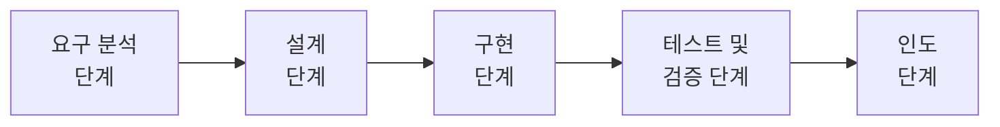
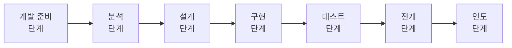
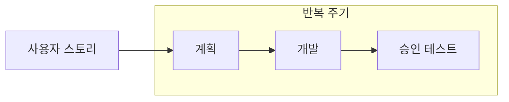

# 소프트웨어 개발 방법론

# 소프트웨어 개발 방법론 개요

## 개발 방법론의 정의와 분류

**정의**

소프트웨어 개발, 유지 보수 등에 필요한 여러 가지 일들의 수행 방법과 이러한 일들을 효율적으로 수행하려는 과정에서 필요한 각종 기법 및 도구를 체계적으로 정리하여 표준화한 것

**목적**

소프트웨어의 생산성과 품질 향상

### 주요 소프트웨어 개발 방법론

- 구조적 방법론
- 정보 공학 방법론
- 객체 지향 방법론
- 컴포넌트 기반(CBD) 방법론
- 제품 계열 방법론
- 애자일 방법론

## 전통적 개발 방법론

### 구조적 방법론

정형화된 분석 절차에 따라 사용자 요구사항을 파악하여 문서화하는 처리(Precess) 중심의  방법론

- 1960년대까지 가장 많이 적용된 소프트웨어 개발 방법론
- 쉬운 이해 및 검증이 가능한 프로그램 코드 생성이 목표
- 복잡한 문제를 다루기 위해 분할과 정복(Divide and Control) 원리를 적용

### 정보공학 방법론

정보 시스템의 개발을 위해 계획, 분석, 설계, 구축에 정형화된 기법들을 상호 연관성 있게 통합 및 적용하는 자료(Data) 중심의 방법론

- 정보 시스템 개발 주기를 이용하여 대규모 정보 시스템 구축에 적합

## 객체 및 컴포넌트 기반 방법론

### 객체지향 방법론

현실 세계의 개체(Entity)를 하나의 객체(Object)로 만들어 소프트웨어 개발 시 기계의 부품을 조립하듯이 객체들을 조립해서 필요한 소프트웨어를 구현하는 방법론

- 구조적 기법의 문제점으로 인한 소프트웨어 위기의 해결책으로 채택
- 구성 요소 : 객체, 클래스, 메세지
- 기본 원칙 : 캡슐화, 정보 은닉, 추상화, 상속성, 다형성 등

### 컴포넌트 기반(CBD, Component Based Design) 방법론

기존의 시스템이나 소프트웨어를 구성하는 컴포넌트를 조합하여 하나의 새로운 애플리케이션을 만드는 방법론

- 컴포넌트의 재사용(Reusability)이 가능하여 시간과 노력 절감 가능
- 새로운 기능을 추가하는 것이 간단하여 확장성 보장
- 유지 보수 비용을 최소화하고 생산성 및 품질 향상

### 제품 계열 방법론

특정 제품에 적용하고 싶은 공통된 기능을 정의하여 개발하는 방법론

- 임베디드 소프트웨어 개발에 적합
- 영역 공학과 응용 공학으로 구분
    - 영역 공학 : 영역 분석, 영역 설계, 핵심 자산을 구현하는 영역
    - 응용 공학 : 제품 요구 분석, 제품 설계, 제품을 구현하는 영역
- 영역 공학과 응용 공학의 연계를 위해 제품의 요구 사항, 아키텍쳐, 조립 생산 필요

# 애자일 개발 방법론

## 애자일 방법론

고객의 요구사항 변화에 유연하게 대응할 수 있도록 일정한 주기를 반복하면서 개발 과정을 진행하는 방법론

- 소규모 프로젝트, 고도로 숙련된 개발자, 급변하는 요구 사항에 적합
- 대표적인 종류에는 익스트림 프로그래밍(XP, eXtreme Programming), 스크럼(Scrum), 칸반(Kanban), 크리스탈(Crystal) 등이 있다.

## 스크럼 (Scrum)

럭비에서 반칙으로 경기가 중단된 경우 양팀의 선수들이 럭비공을 가운데 두고 상대팀을 밀치기 위해 서로 대치해 있는 대형을 의미

이와 같이 팀이 중심이 되어 개발의 효율성을 높인다는 의미가 내포된 용어

- 팀원 스스로가 스크럼 팀을 구성(self-organizing)해야 하며 개발 작업에 관한 모든 것을 스스로 해결(cross-functional)할 수 있어야 한다.
- 스크럼 팀은 제품 책임자, 스크럼 마스터, 개발팀으로 구성

**제품 책임자 (PO, Product Owner)**

이해관계자들 중 개발될 제품에 대한 이해도가 높고, 요구 사항을 책임지고 의사 결정할 사람으로 선정, 주로 개발 의뢰자나 사용자가 담당

- 이해관계자들의 의견을 종합하여 제품에 대한 요구 사항을 작성하는 주체
- 요구 사항이 담긴 백로그(Backlog)를 작성하고 백로그에 대한 우선순위를 지정
- 팀원들이 백로그에 스토리를 추가할 수는 있지만 우선순위 지정은 불가능
- 제품에 대한 테스트를 수행하면서 주기적으로 요구 사항의 우선순위를 갱신

**스크럼 마스터 (SM, Scrum Master)**

스크럼 팀이 스크럼을 잘 수행할 수 있도록 객관적인 시각에서 조언을 해주는 가이드 역할을 수행

- 팀원들의 통제가 목표가 아니다.
- 일일 스크럼 회의를 주관하여 진행 사항을 점검하고 개발 과정에서 발생된 장애 요소를 공론화하여 처리

**개발팀 (DT, Development Team)**

제품 책임자와 스크럼 마스터를 제외한 모든 팀원들로 개발자 외에도 디자이너, 테스터 등 제품 개발을 위해 참여하는 모든 사람이 대상

- 보통 최대 인원은 7-8명이 적당

### 스크럼 개발 프로세스

**제품 백로그 (Product Backlog)**

제품 개발에 필요한 모든 요구 사항(UserStory)을 우선순위에 따라 나열한 목록

- 개발 과정에서 새롭게 도출되는 요구 사항으로 인해 지속적으로 업데이트
- 제품 백로그에 작성된 사용자 스토리를 기반으로 전체 일정 계획인 릴리즈 계획(Release Plan)을 수립

**스프린트 계획 회의 (Sprint Planning Meeting)**

제품 백로그 중 이번 스프린트에서 수행할 작업을 대상으로 단기 일정을 수립

- 스프린트에서 처리할 요구 사항을 개발자들이 나눠서 작업할 수 있도록 태스크(Task)라는 작업 단위로 분할
- 개발자 별로 수행할 작업 목록인 스프린트 백로그(Sprint Backlog) 작성

**스프린트 (Sprint)**

실제 개발 작업을 진행하는 과정으로 보통 2~4주 정도의 기간내에서 진행

- 스프린트 백로그에 작성된 태스크를 대상으로 작업 시간(양)을 추정한 후 개발 담당자에게 할당
- 태스크 할당 시 개발자가 원하는 태스크를 직접 선별하여 담당할 수 있도록 권장
- 개발 담당자에게 할당된 태스크는 보통 할일(ToDo), 진행 중(InProgress), 완료(Done)의 상태를 부여

**일일 스크럼 회의 (Daily Scrum Meeting)**

- 모든 팀원이 매일 약속된 시간에 약 15분 정도의 짧은 시간 동안 진행 상황을 점검
- 남은 작업 시간을 소멸 차트(Burn-downChart)에 표시
- 스크럼 마스터는 발견된 장애 요소를 해결할 수 있도록 도와준다.

## XP(eXtreme Programming)

수시로 발생하는 고객의 요구 사항에 유연하게 대응하기 위해 고객의 참여와 개발 과정의 반복을 극대화하여 개발 생산성을 향상시키는 방법

- 짧고 반복적인 개발 주기, 단순한 설계, 고객의 적극적인 참여를 통해 소프트웨어를 개발하는 것이 목표
- 릴리즈의 기간을 짧게 반복하면서 고객의 요구사항 반영에 대한 가시성을 향상
- 릴리즈 테스트마다 고객을 직접 참여시킴으로써 요구한 기능이 제대로 작동하는지 고객이 직접 확인 가능
- 비교적 소규모 인원의 개발 프로젝트에 효과적
- **5가지 핵심 가치** : 의사소통 (Communidcation), 단순성 (Simplicity), 용기 (Courage), 존중 (Respact), 피드백 (Feedback)

### XP 개발 프로세스

**사용자 스토리 (User Story)**

고객의 요구 사항을 간단한 시나리오로 표현한 것

- 내용은 기능 단위로 구성하며 필요 시 간단한 테스트 사항(Test Case)도 기재

**릴리즈 계획 수립 (Release Planning)**

- 릴리즈 : 몇 개의 스토리가 적용되어 부분적으로 기능이 완료된 제품을 제공
- 부분 혹은 전체 개발 완료 시점에 대한 일정을 수립

**스파이크 (Spike)**

요구 사항의 신뢰성을 높이고 기술 문제에 대한 위험을 감소시키기 위해 별도로 만드는 간단한 프로그램

- 처리할 문제 외의 다른 조건은 모두 무시하고 작성

**이터레이션 (Iteration)**

하나의 릴리즈를 더 세분화한 단위

- 일반적으로 1~3주 정도 진행
- 이 기간 중 새로운 스토리가 작성될 수 있으며 작성된 스토리는 진행 중인 이터레이션 혹은 다음 이터레이션에 포함 가능

**승인 검사 (Acceptance Test, 인수 테스트)**

하나의 이터레이션 안에서 계획된 릴리즈 단위의 부분 완료 제품이 구현되면 수행하는 테스트

- 사용자 스토리 작성 시 함께 기재한 테스트 사항에 대해 고객이 직접 수행
- 테스트 과정에서 발견한 오류 사항은 다음 이터레이션에 포함
- 테스트 이후 새로운 요구 사항이 작성되거나 요구 사항의 상대적 우선순위 변경 가능
- 테스트가 완료되면 다음 이터레이션 진행

**소규모 릴리즈 (Small Release)**

릴리즈를 소규모로 하게 되면 고객의 반응을 기능 별로 확인 가능하여 고객의 요구 사항에 좀더 유연한 대응이 가능

- 계획된 릴리즈 기간동안 진행된 이터레이션이 모두 완료되면 고객에 의한 최종 테스트를 수행한 후 릴리즈, 즉 최종 결과물을 고객에게 전달
- 릴리즈가 최종 완제품이 아닌 경우 다음릴리즈 일정에 맞게 개발을 계속 진행

**XP의 주요 실천 방법 (Practice)**

- Pair Programming (짝 프로그래밍)
    - 다른 사람과 함께 프로르래밍을 수행함으로써 개발에 대한 책임을 공동으로 나눠 갖는 환경을 조성
- Collective Ownership (공동 코드 소유)
    - 개발 코드에 대한 권한과 책임을 공동으로 소유
- Test-Driven Development (테스트 주도 개발)
    - 개발자가 실제 코드를 작성하기 전에 테스트 케이스를 먼저 작성하므로 자신이 무엇을 해야할지를 정확히 파악
- Whole Team (전체 팀)
    - 개발에 참여하는 모든 구성원(고객 포함)들은 각자 자신의 역할이 있고 그 역할에 대한 책임을 가져야 한다.
- Continuous Integration (계속적인 통합)
    - 모듈 단위로 나눠서 개발된 코드들은 하나의 작업이 마무리 될 때마다 지속적으로 통합
- Refactoring (리팩토링)
    - 프로그램의 단순화, 유연성 강화 등을 위해 기능의 변경없이 시스템을 재구성
- Small Releases (소규모 릴리즈)
    - 릴리즈 기간을 짧게 반복함으로써 고객의 요구 변화에 신속한 대응 가능