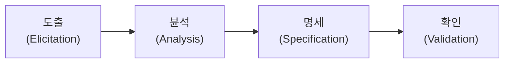
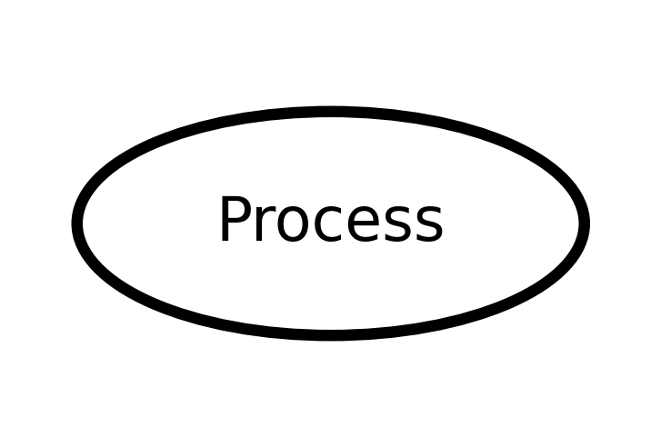
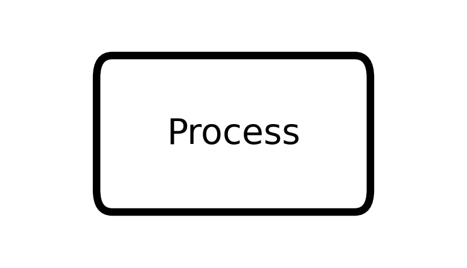
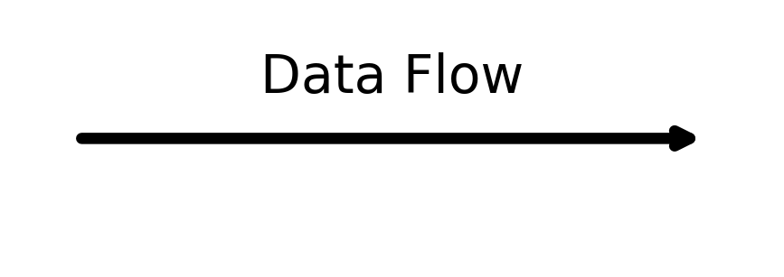
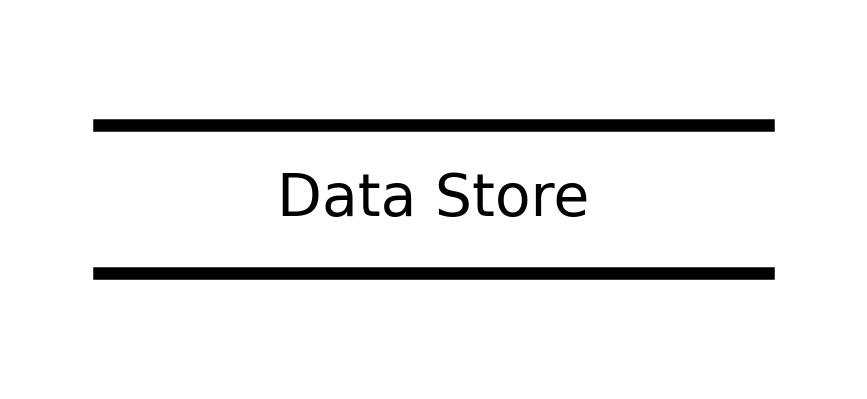
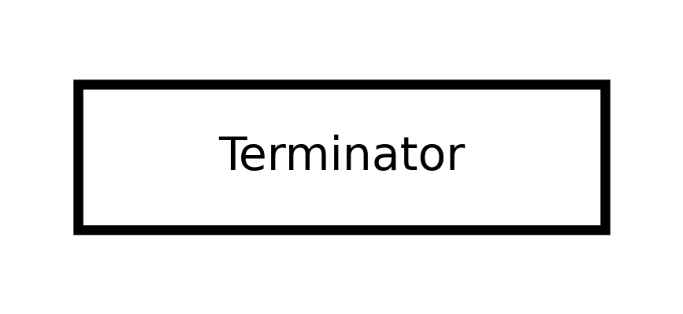

# 요구 사항 공학과 분석 기법

# 요구 사항 공학

## 요구 사항 (Requirements)

소프트웨어가 어떤 문제를 해결하기 위해 제공하는 **서비스에 대한 설명**과 정상적으로 운영하는데 필요한 **제약 조건(Constraints)** 등

- 소프트웨어 개발이나 유지 보수 과정에서 필요한 기준과 근거를 제공
- 개발하려는 소프트웨어의 전반적인 내용을 확인할 수 있게 하므로 개발에 참여하는 이해관계자들 간의 원활한 의사소통을 촉진
- 요구 사항 정의가 제대로 되어야만 이를 토대로 이 후 과정의 목표와 계획 수립 가능

### 요구 사항의 유형

일반적으로 기술하는 내용에 따라 지능 요구 사항과 비기능 요구 사항으로 구분하며 기술 관점과 대상의 범위에 따라 시스템 요구 사항과 사용자 요구 사항으로 구분

**기능 요구 사항 (Functional requirements)**

시스템이 무엇을 하는지, 어떤 기능을 하는지에 대한 사항

- 시스템의 입력이나 출력에 포함되어야 하는 내용
- 시스템이 데이터를 저장하거나 연산을 수행해야 하는 데이터 및 처리 기능
- 시스템이 반드시 수행해야 하는 기능
- 사용자가 시스템을 통해 제공받기를 원하는 기능

**비기능 요구 사항 (Non-Functional requirements)**

시스템의 품질(Quality), 제약(Constraints), 운영 환경 등에 대한 요구 사항

시스템 장비 구성 요구 사항

- 하드웨어, 소프트웨어, 네트워크 등의 시스템 장비 구성에 대한 요구 사항

성능 요구 사항 

- 처리 속도 및 처리 시간, 처리량 동적•정적 적용량, 가용성 등 성능에 대한 요구 사항

인터페이스 요구 사항

- 시스템 인터페이스와 사용자 인터페이스에 대한 요구 사항으로 다른 소프트웨어, 하드웨어 및 통신 인터페이스, 다른 시스템과의 정보 교환에 사용되는 프로토콜의 연계도 포함하여 기술

데이터 요구 사항

- 초기 자료 구축 및 데이터 변환을 위한 대상, 방법, 보안이 필요한 데이터 등 데이터를 구축하기 위해 필요한 요구 사항

테스트 요구 사항

- 도입되는 장비의 성능 테스트(BMT)나  구축된 시스템이 제대로 운영되는지를 테스트하고 점검하기 위한 테스트 요구 사항

보안 요구 사항

- 시스템의 데이터 및 기능, 운영 접근을 통제하기 위한 요구 사항

품질 요구 사항

- 관리가 필요한 품질 항목, 품질 평가 대상에 대한 요구 사항
- 가용성, 정합성, 상호 호환성, 대응성, 신뢰성, 사용성, 유지•관리성, 이식성, 확장성, 보안성 등으로 구분하여 기술

제약 사항

- 시스템 설계, 구축, 운영과 관련하여 사전에 파악된 기술, 표준, 업무 법•제도 등의 제약 조건

프로젝트 관리 요구 사항

- 프로젝트의 원활한 수행을 위한 관리 방법에 대한 요구 사항

프로젝트 지원 요구 사항

- 프로젝트의 원활한 수행을 위한 지원 사항이나 방안에 대한 요구 사항

**사용자 요구 사항 (User requirements)**

사용자 관점에서 본 시스템이 제공해야 할 요구 사항

- 사용자를 위한 것으로 친숙한 표현으로 이해하기 쉽게 작성

**시스템 요구 사항 (System requirements)**

개발자 관점에서 본 시스템 전체가 사용자와 다른 시스템에 제공해야 할 요구 사항

- 사용자 요구 사항에 비해 전문적이고 기술적인 용어로 표현
- a.k.a. 소프트웨어 요구 사항

## 요구 공학(Requirements Engineering)

무엇을 개발해야 하는지 요구 사항을 정의하고 분석 및 관리하는 프로세스를 연구하는 학문

- 점점 복잡하고 대형화 되어가는 소프트웨어 개발 환경에 따라 사용자 요구 사항도 복잡해지고 잦은 변경이 발생하며 이는 요구 사항에 문제가 발생할 가능성을 높이며 요구 사항 관리가 잘못 될 수 있는 원인이 된다.
- 요구 공학은 요구 사항 변경의 원인과 처리 방법을 이해하고 요구 사항 관리 프로세스의 품질을 개선하여 소프트웨어 프로젝트 실패를 최소화하는 것이 목표

### 요구 사항 개발 프로세스

개발 대상에 대한 요구 사항을 체계적으로 도출하고 이를 분석한 후 분석 결과를 명세서(Specification Document)에 정리한 다음 마지막으로 이를 확인 및 검증하는 일련의 구조화된 활동

- 요구 사항 개발 프로세스가 진행되기 전에 개발 프로세스가 비즈니스  목적에 부합하는지, 예산은 적정한지 등에 대한 정보를 수집, 평가한 보고서를 토대로 타당성 조사(Feasibility Study)가 선행되야 한다.
- 요구 공학의 한 요소

### 요구 사항 도출 (Requirements Elicitation, 요구 사항 수집)

시스템, 사용자, 그리고 시스템 개발에 관련된 사람들이 서로 의견을 교환하여 요구 사항이 어디에 있는지, 어떻게 수집할 것인지를 식별하고 이해하는 과정

- 소프트웨어가 해결해야 할 문제를 이해하는 첫 번째 단계
- 요구 사항 도출 단계에서 개발자와 고객 사이의 관계가 만들어지고 이해관계자(Stakeholder)가 식별
- 이 단계에서는 다양한 이해관계자 간의 효율적인 의사소통이 중요
- 요구 사항 도출은 소프트웨어 개발 생명 주기 동안 지속적으로 반복
- 요구 사항을 도출하는 주요 기법에는 청취와 인터뷰, 설문 브레인스토밍, 워크샵, 프로토타이핑, 유스케이스 등이 존재

### 요구 사항 분석 (R**equirements Analysis)**

개발 대상에 대한 사용자의 요구 사항 중 명확하지 않거나 모호하여 이해되지 않는 부분을 발견하고 이를 걸러내기  ㅠ위한 과정

- 사용자 요구 사항의 타당성을 조사하고 비용과 일정에 대한 제약을 설정
- 내용이 중복되거나 하나로 통합되어야 하는 등 서로 상충되는 요구 사항이 있으면 이를 중재하는 과정
- 도출된 요구 사항들을 토대로 소프트웨어의 범위를 파악
- 도출된 요구 사항들을 토대로 소프트웨어와 주변 환경이 상호 작용하는 방법을 이해
- 요구 사항 분석에는 자료 흐름도(DFD), 자료 사전(DD)등의 도구 사용

### 요구 사항 명세

분석된 요구 사항을 바탕으로 모델을 작성하고 문서화

- 요구 사항을 문서화할 때 기능 요구 사항은 빠짐없이 완전하고 명확하게 기술해야 하며 비기능 요구 사항은 필요한 것만 명확하게 기술
- 요구 사항은 사용자가 이해하기 쉬우며, 개발자가 효과적으로 설계할 수 있도록 작성
- 설계 과정에서 잘못된 부분이 확인될 경우 그 내용을 요구 사항 정의서에서 추적할 수 있어야 한다.
- 구체적인 명세서를 위해 소단위 명세서(Mini-Spec)가 사용될 수 있다.

**소프트웨어 요구 사항 명세서(SRS)**

업계 표준 용어로 소프트웨어가 반드시 제공해야 하는 기능, 특징, 제약 조건 등을 명시

- 시스템의 모든 동작 뿐만 아니라 성능, 보안, 사용성과 같은 품질도 기술 필요
- 프로젝트 유형에 맞게 양식을 만들어 사용
- 소프트웨어 요구 사항 명세서에 포함되는 시스템 기능, 데이터, 외부 인터페이스, 품질 요구 사항은 요구 사항 단위별로 개별 요구 사항 명세서를 작성

**요구 사항 명세 기법**

| 구분 | 정형 명세 기법 | 비정형 명세 기법 |
| --- | --- | --- |
| 기법 | 수학적 원리 기반, 모델 기반 | 상태/기능/객체 중심 |
| 작성 방법 | 수학적 기호, 정형화된 표기법 | 일반 명사, 동사 등의 자연어를 기반으로 서술 또는 다이어그램으로 작성 |
| 특징 | • 요구 사항을 **정확**하고 **간결**하게 표현 가능
• 요구 사항에 대한 결과가 작성자에 관계없이 **일관성**이 있으므로 완전성 검증이 가능
• 표기법이 어려워 **사용자가 이해하기 난해** | • 자연어의 사용으로 인해 요구 사항에 대한 결과가 작성자에 따라 다를 수 있어 **일관성이 떨어지고, 해석이 달라질 수 있음**
• 내용의 이해가 쉬워 **의사소통이 용이함** |
| 종류 | VDM, Z, Petri-net, CSP 등 | FSM, Decision Table, ER모델링, State Chart(SADT) 등 |

### 요구 사항 확인 (Requirement Validation) / 검증(Verification)

개발 자원을 요구 사항에 할당하기 전에 요구 사항 명세서가 정확하고 완전하게 작성되었는지를 검토하는 활동

- 요구 사항 문서는 이해관계자들이 검토해야 한다.
- 요구 사항 검증 과정을 통해 모든 문제의 확인은 불가능
- 일반적으로 요구 사항 관리 도구를 이용하여 요구 사항 정의 문서들에 대해 형상 관리를 수행

**Validation(유효성 확인)**

분석가가 요구 사항을 정확하게 이해한 후 요구 사항 명세서를 작성했는지 확인

- 요구 사항이 실제 요구를 반영하는지, 서로 상충되는 요구 사항은 없는지 등을 점검

**Verification(검증)**

요구 사항 명세서의 내용이 이해하기 쉬운지 , 일관성이 있는지, 회사의 기준에 부합한지, 그리고 누락된 기능은 없는지 등을 검증(Verification)하는 것이 중요

- 개발이 완료된 후 문제가 발견되면 재작업 비용이 발생 가능하므로 요구 사항 검증은 매우 중요

### 요구 사항 관리(Requirements Management)

요구 사항 변경이 발생하더라도 프로젝트가 계획된 범위와 목표 안에서 진행될 수 있도록 요구 사항의 상태, 변경 이력, 추적성을 체계적으로 관리하는 활동

- 요구 사항의 잦은 변경은 비용/일정/품질 위험을 증가시키므로 관리가 필요
- 요구 사항과 설계/구현/테스트 산출물 간의 연결 관계를 유지 필요

**요구 사항 관리의 목적**

- 요구 사항 변경으로 인한 범위 증가(Scope Creep) 방지
- 요구 사항의 일관성 및 완전성 유지
- 변경 발생 시 영향 범위를 판단하여 비용/일정 리스크 최소화
- 요구 사항과 산출물 간의 추적성 확보
- 요구 사항 문서 및 관련 산출물의 버전/이력 관리

**요구 사항 변경 관리 (Change Control)**

요구 사항 변경 요청을 통제된 절차로 처리하여 승인된 변경만 반영하는 활동

- 변경 요청 등록
- 변경 영향 분석(비용, 일정, 기능, 품질, 다른 요구 사항에 미치는 영향)
- 변경 승인 또는 반려
- 요구 사항 문서 및 관련 산출물 갱신(SRS, 설계서, 테스트케이스 등)
- 변경 이력 기록 및 공유
- 필요 시 베이스라인 재설정

**요구 사항 추적성 (Traceability)**

요구 사항이 설계, 구현, 테스트로 어떻게 연결되는지 확인할 수 있도록 관계를 유지하는 것

- 전방 추적(Forward Traceability)
    
    요구 사항 → 설계 → 구현 → 테스트
    
- 후방 추적(Backward Traceability)
    
    테스트/구현/설계 → 요구 사항
    
- 요구 사항 식별자(ID)를 부여하여 추적 가능하도록 관리
- 요구 사항 추적 매트릭스(RTM)를 통해 관계를 문서화할 수 있음

**베이스라인(Baseline) 및 버전 관리**

베이스라인은 특정 시점에 승인된 요구 사항의 기준 상태이며, 이후 변경은 절차에 따라 통제됨

- 승인된 요구 사항을 기준선으로 확정하여 임의 변경을 방지
- 요구 사항 문서 및 산출물의 버전과 변경 이력을 관리

**형상 관리(Configuration Management)와의 연계**

요구 사항 정의 문서와 관련 산출물은 형상 관리 대상이 될 수 있음 

- 요구 사항 문서에 대한 변경 통제 수행
- 버전 관리 및 변경 이력 유지
- 산출물 간 불일치 최소화

**요구 사항 상태 관리(Status Tracking)**

요구 사항의 진행 상태를 관리하여 누락 및 혼선을 줄이는 활동

- 제안 → 분석 → 승인 → 구현 → 검증 같은 상태 흐름으로 관리 가능
- 상태 정보는 요구 사항 관리 및 변경 통제에 활용됨
- 요구 사항 관리 핵심: 변경 관리 + 추적성 + 베이스라인/형상 관리
- 전방 추적: 요구 사항 → 설계 → 구현 → 테스트
- 후방 추적: 테스트/구현/설계 → 요구 사항
- 변경 요청 처리: 등록 → 영향 분석 → 승인 → 반영 → 이력 관리

# 요구 사항 분석 기법(모델링/도구)

## 구조적 분석 (Structured Analysis) 기법

자료의 흐름과 처리를 중심으로 하는 요구 사항 분석 방법

- 도형 중심의 분석용 도구와 분석 절차를 이용하여 사용자의 요구 사항을 파악하고 문서화
- 도형 중심의 도구를 사용하므로 분석가와 사용자 간의 대화가 용이
- 하향식 방법을 사용하여 시스템을 세분화할 수 있고 분석의 중복 배제 가능
- 사용자의 요구 사항을 논리적으로 표현하여 전체 시스템을 일관성 있게 이해 가능
- 시스템 분석의 질이 향상되고 시스템 개발의 모든 단계에서 필요한 명세서 작성이 가능
- 구조적 분석 기법에서는 자료 흐름도(DFD), 자료 사전(Data Dictionary), 소단위 명세서(Mini-Spec), 개체 관계도(ERD), 상태 전이도(STD), 제어 명세서 등의 도구를 이용하여 모델링

### 자료 흐름도(DFD, Data Flow Chart)

요구 사항 분석에서 자료의 흐름 및 변환 과정과 기능을 도형 중심으로 기술하는 방법으로 자료 흐름 그래프, 버블 차트라고 한다.

- 시스템 안의 프로세스와 자료 저장소 사이에 자료의 흐름을 나타내는 그래프로 자료 흐름과 처리를 중심으로 하는 구조적 분석 기법에 이용
- 자료 흐름도는 자료 흐름과 기능을 자세히 표현하기 위해 단계적으로 세분화
- 자료는 처리(Process)를 거쳐 변환될 때마다 새로운 이름이 부여되며 처리는 입력 자료가 발생하면 기능을 수행한 후 출력 자료를 산출
- 자료 흐름도에서는 자료의 흐름과 기능을 프로세스(Processs), 자료 흐름(Flow), 자료 저장소(Data Store), 단말(Terminator)의 네 가지 기본 기호로 표시
- **프로세스 (Process)**
    - **의미**
        - 자료를 변환시키는 시스템의 한 부분(처리 과정)
        - 처리, 기능, 변화, 버블이라고도 함
    - **표기**
        - **Yourdon / DeMarco**: 원(또는 둥근 사각형) 안에 프로세스 이름 기입
            
            
            
        - **Gane / Sarson**: 둥근 사각형 박스 안에 프로세스 이름 기입
            
            
            
- **자료 흐름 (Data Flow)**
    - **의미**
        - 자료의 이동(흐름) 또는 연관관계를 나타냄
    - **표기**
        - 화살표(→) 위에 자료 이름 기입
            
            
            
- **자료 저장소 (Data Store)**
    - **의미**
        - 시스템에서의 자료 저장 장소(파일, 데이터베이스 등)
    - **표기**
        - **Yourdon / DeMarco**: 평행선(=) 형태에 저장소 이름 기입
            
            
            
        - **Gane / Sarson**: ID 영역이 포함된 저장소 박스(좌측 ID, 우측 저장소명)
            
            
            
- **단말 (Terminator)**
    - **의미**
        - 시스템과 교신하는 외부 개체
        - 입력 데이터를 만들거나 출력 데이터를 받는 주체(정보의 생산자/소비자)
    - **표기**
        - 사각형 박스 안에 외부 개체 이름 기입
            
            
            

### 자료 사전(DD, Data Dictionary)

자료 흐름도에 있는 자료를 더 자세히 정의하고 기록

데이터를 설명하는 데이터를 데이터의 데이터나 메타 데이터(Meta Data)라고 한다.

- 자료 흐름도에서 시각적으로 표시된 자료에 대한 정보를 체계적이고 조직적으로 모아 개발자나 사용자가 편리하게 사용 가능
- 자료 사전에서 사용되는 표기 기호
    
    
    | **기호** | **의미** |
    | --- | --- |
    | = | 자료의 정의: ~로 구성되어 있다 (is composed of) |
    | + | 자료의 연결: 그리고 (and) |
    | ( ) | 자료의 생략: 생략 가능한 자료 (Optional) |
    | [|] | 자료의 선택: 또는 (or) |
    | { } | 자료의 반복: Iteration of
    ① { }ₙ : n번 이상 반복
    ② { }ⁿ : 최대 n번 반복
    ③ { }ᵐₙ : m 이상 n 이하로 반복 |
    | * * | 자료의 설명: 주석 (Comment) |

### 소단위 명세서(Mini-Specification)

자료 흐름도 상의 최하위 처리 절차를 상세하게 기술하는 데 사용되는 도구 a.k.a. 프로세스 명세서

- 자료 흐름도를 지원하기 위해 작성
- 수작업 부분과 자동화 부분을 분리하는 내용이나 설계 내용을 미리 판단하기 위한 내용이 포함되어서는 안된다.
- 구조적 언어, 의사 결정표(판단표), 의사 결정도를 이용하여 기술
- 최하위 처리 절차 : 더 이상 세분화할 수 없는 단계의 프로세스. a.k.a. 원시 버블, 프리미티브 버블(Primitive Bubble)

### 개체 관계도(ERD, Entity Relationship Diagram)

시스템에서 처리되는 개체(자료)와 개체의 구성과 속성, 개체 간의 관계를 표현하여 개체를 모델화하는 도구

- 자료 흐름도의 자료 저장소를 종합적이고 체계적으로 모델링
- 개체(Entity), 관계(Relationship),  속성 (Attribute) 등으로 구성
- 개체 (Entity)
    - 소프트웨어에 의해 인식되는 여러 종류의 정보
        
        
        
- 관계 (Relationship)
    - 개체 간에 존재하는 상호 작용
        
        
        
- 속성 (Attribute)
    - 개체에 관련된 특성
        
        
        

### 상태 전이도(STD, State Transition Diagram)

시스템이나 프로세스가 특정 사건(event)에 따라 시스템의 상태와 상태의 변화를 모델링한 그림

개발자는 상태 전이도를 통해 시스템의 행위 정의 가능

- 시스템의 상태 (State) :  시스템이 수행중인 상태를 의미. 직사각형으로 포현
- 상태의 변화 (전이, Transition) : 시스템이 어떤 상태에서 다른 상태로 변환되는 과정을 의미. 화살표로 표현
- 상태의 변화를 일으키는 조건과 그 조건이 상태를 변화시킬 때 시스템이 취하는 행동을 제시
- 화살표의 시작은 상태 변화를 일으키는 사건을 의미하며 화살표의 끝은 사건의 결과로 발생하는 내용(행동)

## 요구 사항 분석 지원 도구

### CASE (Computer Aided Software Engineering, 자동화 도구)

요구 사항을 자동으로 분석하고 요구 사항 분석 명세서를 기술하도록 개발된 도구

**이점**

- 표준화와 보고를 통한 문서화 품질 개선
- 데이터베이스가 모두에게 이용 가능 → 분석자들 간의 적절한 조정
- 교차 참조도와 보고서를 통한 결함, 생략, 불일치 등의 발견 용이성
- 변경이 주는 영향 추적의 용이성
- 명세에 대한 유지 보수 비용의 축소

요구 사항 분석을 위한 자동화 도구로는 SADT, SREM, PSL/PSA, TAGS, EPOS 등

**SADT (Structured Analysis and Design Technique)**

SoftTech사에서 개발

시스템 정의, 소프트웨어 요구 사항 분석, 시스템/소프트웨어 설계를 위해 널리 이용되어 온 구조적 분석 및 설계 도구

- 구조적 요구 분석을 위해 블록 다이어그램을 채택한 자동화 도구

**SREM (Software Requirements Engineering Methdology) = PSL/REVS**

TRW 사가 우주 국방 시스템 그룹에 의해 실시간 처리 소프트웨어 시스템에서 요구 사항을 명확히 기술하도록 할 목적으로 개발

RSL과 REVS를 사용하는 자동화 도구

- **RSL (Requirement Statement Language)**
    - 요소 속성, 관계, 구조들을 기술하는 요구 사항 기술 언어
    - 요소 : 요구 사항 명세를 개발하기 위해 사용되는 개체와 개념
    - 속성 : 요소를 수정하거나 수식하기 위한 것
    - 관계 : 개체들 간 관계
    - 구조 : 정보 흐름을 묘사
- **REVS (Requirement Engineering and Validation System)**
    - RSL로 기술된 요구 사항들을 자동으로 분석하여 요구 사항 분석 명세서를 출력하는 요구 사항 분석기

**PSL/PSA**

- 미시간 대학에서 개발한 PSL과 PSA를 사용하는 자동화 도구
- **PSL (Problem Statement Language)** : 문제(요구 사항) 기술 언어
- **PSA (Problem Statement Analyzer)** : PSL로 기술된 요구 사항을 자동으로 분석하여 다양한 보고서를 출력하는 문제 분석기

**TAGS (Technology for Automated Generation of System)**

- 시스템 공학 방법 응용에 대한 자동 접근 방법으로 개발 주기의 전 과정에 이용 가능한 자동화 도구
- 구성 : IORL, 요구 사항 분석과 IORL 처리를 위한 도구, 기초적인 TAGS 방법론
- IORL : 요구 사항 명세 언어

### HIPO (Hierarchy Input Process Output)

시스템의 분석 및 설계나 문서화 시 사용되는 기법

시스템 실행 과정인 입력, 처리,출력의 기능을 표현

- 기본 시스템 모델은 입력, 처리, 출력으로 구성되며 하향식 소프트웨어 개발을 위한 문서화 도구
- 체계적인 문서 관리 가능
- 기호, 도표 등을 사용하여 보기 쉽고 이해하기도 쉽다.
- 기능과 자료의 의존 관계 동시 표현 가능
- 변경, 유지 보수 용이
- 시스템의 기능을 여러 개의 고유 모듈들로 분할하여 이들 간의 인터페이스를 계층 구조로 표현한 것을 HIPO Chart라고 한다.
- HIPO Chart의 종류 : 가시적 도표 (Visual Table of Content), 총체적 도표 (Overview Diagram), 세부적 도표(Detail Diagram)
- 가시적 도표 (도표 목차)
    - 시스템의 전체적인 기능과 흐름을 보여주는 계층(Tree) 구조도
- 총체적 도표 (총괄 도표, 개요 도표)
    - 프로그램을 구성하는 기능을 기술
    - 입력, 처리 출력에 대한 전반적인 정보를 제공하는 도표
- 세부적 도표 (상세 도표)
    - 총체적 도표에 표시된 기능을 구성하는 기본 요소들을 상세히 기술하는 도표