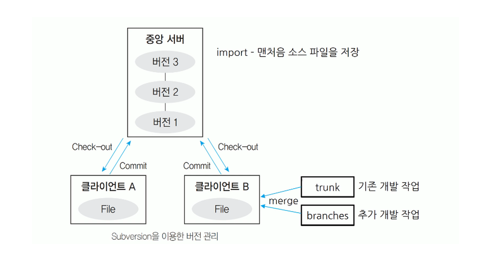
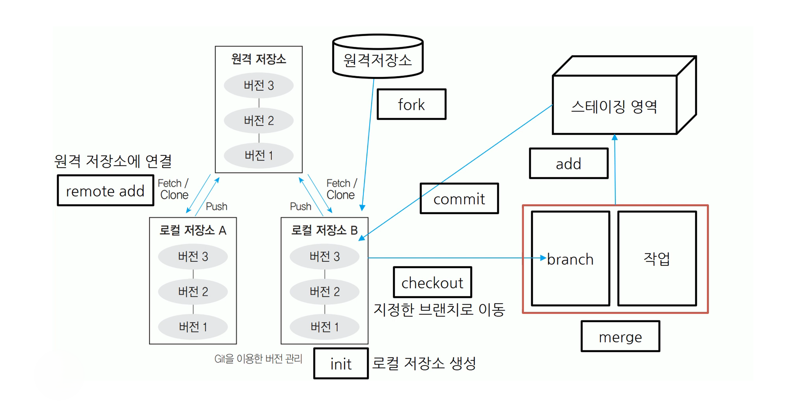

# 형상 관리와 빌드 자동화

# 형상 관리

## 형상 관리

### 형상 관리 (SCM, Software Configuration Management)

소프트웨어의 개발 과정에서 소프트웨어의 변경 사항을 관리하기 위해 개발된 일련의 활동

- 소프트웨어의 변경 원인을 알아내고 제어하며 적절히 변경되고 있는지 확인하여 해당 담당자에게 통보
- 소프트웨어 개발의 전 단계에 적용되는 활동이며 유지 보수 단계에서도 수행
- 소프트웨어 개발의 전체 비용을 줄이고, 개발 과정의 여러 방해 요인이 최소화되도록 보증하는 것이 목적
- 관리 항목에는 소스 코드뿐만 아니라 프로젝트 계획, 분석서, 설계서, 프로그램, 테스트 케이스 등이 포함
- 형상 관리를 통해 가시성과 추적성을 보장함으로써 소프트웨어의 생산성과 품질을 향상
- 대표적인 형상 관리 도구로는 Git, CVS, Subversion 등

**형상 관리의 중요성**

지속적인 소프트웨어의 변경 사항을 체계적으로 추적하고 통제 가능

- 제품 소프트웨어에 대한 무절제한 변경을 방지
- 제품 소프트웨어에서 발견된 버그나 수정 사항 추적 가능
- 소프트웨어는 형태가 없어 가시성이 결핍되므로 진행 정도를 확인하기 위한 기준으로 사용 가능
- 소프트웨어의 배포본을 효율적으로 관리 가능
- 소프트웨어를 복수의 개발자가 동시에 개발 가능

**형상 관리 기능**

- 형상 식별(Configuration Identification) : 형상 항목(CI)을 선정하고 명칭/ID/구성 및 기준선(Baseline)을 정의하는 활동
- 버전 제어 (Version Control) : 형상 항목의 변경 내용을 버전별로 저장·관리하여 추적/비교/복구 가능하게 하는 기능
- 형상 통제 (Configuration Control) : 변경 요청을 평가·승인·반영하는 절차로 변경을 통제하여 무분별한 변경을 방지하는 활동
- 형상 감사 (Configuration Audit) : 형상 항목이 요구 사항/기준선/표준에 일치하는지 검증·점검하는 활동
- 형상 기록 (Configuration Status Accounting) : 형상 항목의 변경 상태와 이력(누가/언제/무엇을/왜)을 기록·보고하는 기능

### 버전 관리

**소프트웨어 버전 등록 관련 주요 기능**

- 저장소(Repository): 소스코드와 관련 산출물을 저장하고 버전 이력을 관리하는 중앙/공유 공간
- 가져오기(Import): 외부(또는 기존) 프로젝트/파일을 형상 관리 저장소로 처음 등록하여 관리 대상으로 만드는 작업
- 체크 아웃(Check-Out): 저장소의 파일/버전을 작업 공간으로 가져와 수정하거나 사용 가능하게 만드는 작업
- 체크인(Check-In): 작업 공간에서 수정한 내용을 저장소에 반영(등록)하여 다른 사람도 사용할 수 있게 만드는 작업
- 커밋(Commit): 변경 사항을 하나의 단위로 확정 저장하고 메시지와 함께 버전 이력으로 남기는 작업
- 동기화(Update): 저장소의 최신 변경 내용을 내려받아 작업 공간을 최신 상태로 맞추는 작업

**소프트웨어 버전 등록 과정**

1. 가져오기 (Import)
    - 외부/기존 파일을 저장소에 처음 등록해 버전 관리 시작
2. 인출 (Check-Out)
    - 저장소의 파일/버전을 작업 공간으로 가져와 수정 가능하게 함
3. 예치 (Commit)
    - 변경 내용을 하나의 단위로 확정 저장하고 이력(메시지)으로 남김
4. 동기화 (Update)
    - 저장소의 최신 변경 내용을 내려받아 작업 공간을 최신 상태로 맞춤
5. 차이 (Diff)
    - 파일/버전 간 변경된 부분을 비교해서 차이를 확인

### 형상 관리 시스템

**공유 폴더 방식**

버전 관리 자료가 로컬 컴퓨터의 공유 폴더에 저장되어 관리되는 방식

- 개발자들은 개발이 완료된 파일을 약속된 공유 폴더에 매일 복사
- 담당자는 공유 폴더의 파일을 자기 PC로 복사한 후 컴파일 하여 이상 유무를 확인
- 이상 유무 확인 과정에서 파일의 오류가 확인되면 해당 파일을 등록한 개발자에게 수정을 의뢰한다.
- 파일에 이상이 없다면 다음날 각 개발자을이 동작 여부를 다시 확인
- 파일을 잘못 복사하거나 다른 위치로 복사하는 것에 대비하기 위해 파일의 변경 사항을 데이터베이스에 기록하여 관리
- 종류로는 SCCS, RCS,PVCS, QVCS 등

**클라이언트/서버 방식**

버전 관리 자료가 중앙 시스템(서버)에 저장되어 관리되는 방식

- 서버의 자료를 개발자별로 자신의 PC(클라이언트)로 복사하여 작업한 후 변경된 내용을 서버에 반영
- 모든 버전 관리는 서버에서 수행
- 하나의 파일을 서로 다른 개발자가 작업할 경우 경고 메세지를 출력
- 서버에 문제가 생기면 서버가 복구되기 전까지 다른 개발자와의 협업 및 버전 관리 작업은 중단
- 종류로는 CVS, SVN(Subversion), CVSNT, Clear Case, CMVC, Perforce 등

**분산 저장소 방식**

버전 관리 자료가 하나의 원격 저장소와 분산된 개발자 PC의 로컬 저장소에 함께 저장되어 관리하는 방식

- 개발자별로 원격 저장소의 자료를 자신의 로컬 저장소로 복사하여 작업한 후 변경된 내용을 로컬 저장소에서 우선 반영(버전 관리)한 다음 이를 원격 저장소에 반영
- 로컬 저장소에서 버전 관리가 가능하므로 원격 저장소에 문제가 생겨도 로컬 저장소의 자료를 이용하여 작업이 가능
- 종류로는 Git, GNU, arch, DCVS, Bazaar, Mercurial, TeamWare, Bitkeeper, Plastic SCM

## **형상 관리 도구**

### **Subversion (SVN, 서브비전)**

CVS를 개선한 것으로 아파치 소프트웨어 재단에서 2000년 발표

- 클라이언트/서버 구조
- 서버(저장소, Repository)에는 최신 버전의 파일들과 변경 내역이 관리된다.
- 모든 개발 작업은 trunk 디렉터리에서 수행되며 추가 작업은 branches 디렉터리 안에 별도의 디렉터리를 만들어 작업을 완료한 후 trunk 디렉터리와 병합(merge)한다.
- 커밋(Commit)할 때마다 리비전(Revision)이 씩 증가
- 클라이언트는 대부분의 운영체제에서 사용되나 서버는 주로 유닉스를 사용
- 소스가 오픈되어 있어 무료로 사용 가능
- CVS의 단점이었던 파일이나 디렉터리의 이름 변경, 이동 등이 가능

**명령어**

- add
    - 새로운 파일이나 디렉터리를 버전 관리 대상으로 등록
    - add로 등록되지 않은 대상은 commit 미적용
- commit
    - 버전 관리 대상으로 등록된 클라이언트의 소스 파일을 서버의 소스 파일에 적용
- update
    - 서버의 최신 commit 이력을 클라이언트의 소스 파일에 적용
    - commit 전에는 매번 update를 먼저 수행하여 클라이언트에 적용되지 않은 서버의 변동 내역을  클라이언트에 적용
        - Out-of-date(내 기반이 최신이 아님) 방지
        - 충돌을 로컬에서 미리 해결해서 저장소 안정성 유지
- checkout
    - 버전 관리 정보와 소스 파일이나 디렉터리를 잠그거나 해제
- lock/unlock
    - 서버의 소스 파일이나 디렉터리를 잠그거나 해제
- import
    - 아무것도 없는 서버의 저장소에 제일 처음 소스 파일을 저장하는 명령
    - 한 번 사용 후 다시 사용하지 않는다.
- export
    - 버전 관리에 대한 정보를 제외한 순수한 소스 파일만을 서버에서 받아온다.
- info
    - 지정한 파일에 대한 위치나 마지막 수정 일자 등에 대한 정보를 표시
- diff
    - 지정된 파일이나 경로에 대해 이전 리비전과의 차이를 표시
- merge
    - 다른 디렉터리에서 작업된 버전 관리 내역을 기본 개발 작업과 병합

### **Git (깃)**

리누스 토발즈(Linus Tovalds)가 2005년 리눅스 커널 개발에 사용할 관리 도구로 개발한 이후 주니오 하마노(Junio Hamano)에 의해 유지 보수 중

- 분산 버전 관리 시스템
- 2개의 저장소, 즉 지역(로컬) 저장소와 원격 저장소가 존재
- 지역 저장소는 개발자들이 실제 개발을 진행하는 장소로 버전 관리가 수행된다.
- 원격 저장소는 여러 사람들이 협업을 위해 버전을 공동 관리하는 곳으로 자신의 버전 관리 내역을 반영하거나 다른 개발자의 변경 내용을 가져올 때 사용
- 버전 관리가 지역 저장소에서 진행되므로 버전 관리가 신속하게 처리되고 원격 저장소나 네트워크에 문제가 있어도 작업이 가능
- 브랜치를 이용하면 기본 버전 관리 틀에 영향을 주지 않으면서 다양한 형태의 기능 테스팅이 가능
- 파일의 변화를 스냅샷(Snabshot)으로 저장
- 스냅샷은 이전 스냅샷의 포인터를 가니므로 버전의 흐름 파악 가능

**명령어**

- merge
    - 지정한 브랜치의 변경 내역을 현재 HEAD 포인터가 가리키는 브랜치에 반영함으로써 두 브랜치를 병합
- init
    - 지역 저장소를 생성
- remote add
    - 원격 저장소에 연결
- push
    - 로컬 저장소의 변경 내역을 원격 저장소에 반영
- fetch
    - 원격 저장소의 변경 이력만을 지역 저장소로 가져와 반영
- clone
    - 원격 저장소의 전체 내용을 지역 저장소로 복제
- fork
    - 지정한 원격 저장소의 내용을 자신의 원격 저장소로 복제

# 빌드 자동화

## 빌드 자동화 도구

빌드(Build)란 소스 코드 파일들을 컴파일한 후 여러 개의 모듈을 묶어 실행 파일로 만드는 과정이며 이러한 빌드를 포함하여 테스트 및 배포를 자동화 하는 도구가 빌드 자동화 도구다.

- 애자일 환경에서는 하나의 작업이 마무리될 때마다 모듈 단위로 나눠서 개발된 코드들이 지속적으로 통합되는데 이러한 지속적인 통합(Continue Integration) 개발 환경에서 빌드 자동화 도구는 유용하게 활용
- Ant, Make, Gradle, Jenkuns 등

### Jenkins

JAVA 기반의 오픈 소스 형태로 가장 많이 사용되는 빌드 자동화 도구

- 서블릿 컨테이너에서 실행되는 서버 기반 도구
- SVN, Git 등 대부분의 형상 관리 도구와 연동이 가능
- 친숙한 Web GUI 제공으로 쉬운 사용
- 여러 대의 컴퓨터를 이용한 분산 빌드나 테스트가 가능

### Gradle

Groovy를 기반으로 한 오픈 소스 형태의 자동화 도구로 안드로이드 앱 개발 환경에서 사용텨

- 안드로이드 뿐만 아니라 플러그인 설정에 따라 JAVA, C/C++, Python 등의 언어로 빌드 가능
- Groovy를 사용해서 만든 DSL(Domain Specific Language)을 스크립트 언어로 사용
- 실행할 처리 명령들을 모아 태스크(Task)로 만든 후 태스크 단위로 실행
- 이전에 사용했던 태스크를 재사용하거나 다른 시스템의 태스크를 공유할 수 있는 빌드 캐시 기능을 지원하므로 빌드 속도 향상 가능