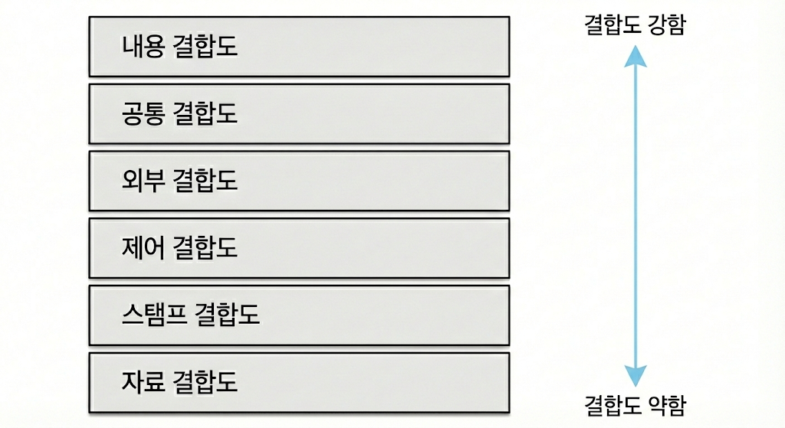

# 모듈과 시스템 설계

# 모듈 설계

## 모듈(Module)

### 모듈의 개요

모듈화를 통해 분리된 시스템의 각 기능들

- 서브루틴, 서브 시스템, 소프트웨어 내의 프로그램, 작업 단위 등과 같은 의미로 사용
- 모듈은 단독으로 컴파일이 가능하며 재사용 가능
- 모듈의 기능적 독립성은 소프트웨어를 구성하는 각 모듈의 기능이 서로 독립됨을 의미하며 모듈이 하나의 기능만을 수행하고 다른 모듈과의 과도한 상호작용을 배제함으로써 달성
- 독립성이 높은 모듈일수록 수정하더라도 다른 모듈들에게는 영향을 거의 미치지 않으며 오류 발생 시에도 쉽게 해결 가능
- 모듈의 독립성은 결합도와 응집도에 의해 측정되며 독립성을 높이려면 모듈의 결합도는 약하게, 응집도는 강하게, 모듈의 크기는 작게 만들어야 한다.

## 모듈 설계 품질

### 결합도 (Coupling)

모듈 간에 상호 의존하는 정도 또는 두 모듈 사이의 연관 관계를 의미

- 다양한 결합으로 모듈 구성은 가능하나 결합도가 약할수록 품질이 높고 강할수록 품질이 낮다.
- 결합도가 강하면 시스템 구현 및 유지 보수 작업이 어렵다.
- 결합도의 종류에는 자료 결합도, 스탬프 결합도, 제어 결합도, 외부 결합도, 공통 결합도, 내용 결합도가 있다.

**결합도의 정도**

**자료 결합도 (Data Coupling)**

- 모듈 간 인터페이스가 자료 요소로만 구성될 때의 결합도
- 어떤 모듈이 다른 모듈을 호출하면서 매개 변수나 인수로 데이터를 넘겨 주고 호출 받은 모듈은 받은 데이터에  대한 처리 결과를 다시 반환하는 방식
- 모듈 간 내용을 전혀 알 필요가 없는 상태로서 한 모듈의 내용 변경 시에도 다른 모듈에는 전혀 영향을 미치지 않는 가장 바람직한 결합도

**스탬프(검인) 결합도 (Stamp Coupling)**

- 모듈 간의 인터페이스로 배열이나 레코드 등의 자료 구조가 전달될 때의 결합도
- 두 모듈이 동일한 자료 구조를 조회하는 경우의 결합도
- 자료 구조의 변화, 즉 포맷이나 구조의 변화는 그것을 조회하는 모든 모듈 및 변화하는 필드를 실제로 조회하지 않는 모듈에까지도 영향

**제어 결합도 (Control Coupling)**

- 어떤 모듈이 다른 모듈 내부의 논리적인 흐름을 제어하기 위해 제어 신호를 이용하여 통신하거나 제어 요소(Function Code, Switch, Tag, Flag)를 전달하는 결합도
- 한 모듈이 다른 모듈의 상세한 처리 절차를 알고 있어 이를 통제하는 경우나 처리 기능이 두 모듈에 분리되어 설계된 경우 발생
- 하위 모듈에서 상위 모듈로 제어 신호가 이동하여 하위 모듈이 상위 모듈에게 처리 명령을 내리는 권리 전도 현상 발생

**외부 결합도 (External Coupling)**

- 어떤 모듈에서 선언한 데이터(변수)를 외부의 다른 모듈에서 참조할 때의 결합도
- 참조되는 데이터의 범위를 각 모듈에서 제한 가능

**공통(공유) 결합도 (Common Coupling)**

- 공유되는 데이터 영역을 여러 모듈이 사용할 때의 결합도
- 공통 데이터 영역의 내용을 조금만 변경하더라도 이를 사용하는 모든 모듈에 영향을 미치므로 모듈의 독립성을 약화

**내용 결합도 (Content Coupling)**

- 한 모듈이 다른 모듈의 내부 기능 및 그 내부 자료를 직접 참조하거나 수정 할 때의 결합도
- 한 모듈에서 다른 모듈의 내부로 제어가 이동하는 경우에도 내용 결합도에 포함

### 응집도 (Cohepsion)

정보 은닉 개념을 확장한 것으로 호출문 등 모듈의 내부 요소들이 서로 관련되어 있는 정도

- 모듈이 독립적인 기능으로 정의되어 있는 정도를 의미
- 다양한 기준으로 모듈을 구성할 수 있으나 응집도가 강할수록 품질이 높고 약할수록 품질이 낮다.
- 종류로는 기능적 응집도, 순차적 응집도, 교환(통신)적 응집도, 절차적 응집도, 시간적 응집도, 논리적 응집도, 우연적 응집도가 있다.

**응집도의 정도**

**기능적 응집도 (Functional Cohepsion)**

- 모듈 내부의 모든 기능 요소들이 단일 문제와 연관되어 수행될 경우의 응집도

**순차적 응집도 (Sequential Cohepsion)**

- 모듈 내 하나의 활동으로부터 나온 출력 데이터를 그 다음 활동의 입력 데이터로 사용할 경우의 응집도

**교환(통신) 응집도 (Communication Cohepsion)**

- 동일한 입력과 출력을 사용하여 서로 다른 기능을 수행하는 구성 요소들이 모였을 경우의 응집도

**절차적 응집도 (Procedural Cohepsion)**

- 모듈이 다수의 관련 기능을 가질 때 모듈 내의 구성 요소들이 그 기능을 순차적으로 수행할 경우의 응집도

**시간적 응집도 (Temporal Cohepsion)**

- 특정 시간에 처리되는 몇 개의 기능을 모아 하나의 모듈로 작성할 경우의 응집도

**논리적 응집도 (Logical Cohepsion)**

- 유사한 성격을 갖거나 특정 형태로 분류되는 처리 요소들로 하나의 모듈이 형성되는 경우의 응집도

**우연적 응집도 (Coincidental Cohepsion)**

- 모듈 내부의 각 요소들이 서로 관련 없는 요소로만 구성된 경우의 응집도

### 팬인 (Fan-In) / 팬아웃 (Fan-Out)

- **팬인** : 어떤 모듈을 제어(호출)하는 모듈의 수
- **팬아웃** : 어떤 모듈에 의해 제어(호출)되는 모듈의 수
- 팬인과 팬아웃을 분석하여 시스템의 복잡도 확인 가능
- 팬인이 높다면 재사용 측면에서 설계가 잘 되어있다고 볼 수 있으나 단일 장애점이 발생 가능하여 중점적인 관리 및 테스트 필요
- 팬아웃이 높은 경우 불필요하게 다른 모듈을 호출하고 있는지 검토하고 단순화시킬 수 있는지 여부에 대한 검토가 필요
- 시스템의 복잡도를 최적화하려면 팬인은 높게, 팬아웃은 낮게 설계

**호출 관계 분석**

콜 그래프(Call graph)를 만들고, 각 모듈의 in-degree(팬인), out-degree(팬아웃)를 계산해 품질 리스크를 찾는 작업

- 목표는 “무조건 낮추기”가 아니라, 역할에 맞는 균형(유틸/서비스는 팬인↑ 가능, 오케스트레이션은 팬아웃↑ 가능)과 과도한 극단값 완화.
1. 분석 단위 정의
    - 모듈 단위를 함수/클래스/패키지 중 하나로 정하고, 경계(공개 API vs 내부 함수 포함 여부)를 명시한다.
2. 호출 관계 수집
    - 정적 분석(코드 상 호출), 혹은 동적 분석(런타임 트레이스)으로 “누가 누구를 호출하는가”를 수집한다.
    - 재귀/오버로딩/다형성(인터페이스 호출) 같은 애매한 호출은 “보수적 추정(가능 대상 모두 포함)” 또는 “실행 기반 확인” 중 정책을 정한다.
3. 콜 그래프 구성
    - 노드: 모듈, 간선 A→BA \rightarrow BA→B: A가 B를 호출
    - 방향성 그래프로 모델링한다.
4. 팬인/팬아웃 계산
    - 각 모듈 MMM에 대해
        - $FanIn(M)=∣{X∣X→M}∣$
        - $FanOut(M)=∣{Y∣M→Y}∣$
5. 해석 및 리스크 식별
    - 팬인 높은 모듈: 공통 기능/핵심 서비스일 가능성 → 변경 시 영향이 넓으므로 안정성/테스트/버전관리 중요
    - 팬아웃 높은 모듈: 의존성이 많아 복잡도/결합도 상승 → 변경 파급과 장애 전파 위험
    - “극단값(상위 n%)” 모듈을 우선 점검 대상으로 선정한다.

## 설계 기법

### N-S 차트 (Nassi-Schneiderman Chart)

알고리즘의 제어 흐름을 블록 중첩 구조로 표현하는 방법

- a.k.a. 박스 다이어그램, Chapin Chart
- 연속, 선택 및 다중 선택, 반복 등의 구조적 제어 논리 구조를 표현
- GOTO나 화살표를 사용하지 않으며 블록의 중첩 자체가 제어 구조를 의미
- 조건이 복합되어 있는 곳의 처리를 시각적으로 명확히 식별하는데 적합
- 선택과 반복 구조를 시각적으로 표현
- 이해하기 쉽고 코드 변환이 용이
- 읽기는 쉽지만 작성하기가 어려우며 임의로 제어를 전이하는 것이 불가능
- 총체적인 구조 표현과 인터페이스를 나타내기가 어렵다.
- 단일 입구와 단일 출구 형태를 지향

## 공통 모듈

### 공통 모듈의 개요

여러 프로그램에서 공통적으로 사용할 수 있는 모듈을 의미

- 자주 사용되는 계산식이나 매번 필요한 사용자 인증과 같은 기능들이 공통 모듈로 구성 가능
- 모듈의 재사용성 확보와 중복 개발 회피를 위해 설계 과정에서 공통 부분 식별 및 명세 작성 필요
- 공통 모듈 구현 시 타 개발자들이 해당 기능을 명확히 이해할 수 있도록 명세 기법 준수 필요

**명세 기법**

정확성 (Correctness)

- 시스템 구현 시 해당 기능이 필요하다는 것을 알 수 있도록 정확히 작성해야 한다.

명확성 (Clarity)

- 해당 기능을 이해할 때 중의적으로 해석되지 않도록 명확히 작성

완전성 (Completency)

- 시스템 구현을 위해 필요한 모든 것을 기술

일관성 (Consistancy)

- 공통 기능들 간 상호 충돌이 발생하지 않도록 작성

추적성 (Traceability)

- 기능에 대한 요구 사항의 출처, 관련 시스템 등의 관계를 파악할 수 있도록 작성

### 재사용 (Reuse)

비용과 개발 시간을 절약하기 위해 이미 개발된 기능들을 파악하고 재구성하여 새로운 시스템 또는 기능 개발에 사용하기 적합하도록 최적화 시키는 작업

- 재사용을 위해서는 누구나 이해할 수 있고 사용이 가능하도록 사용법을 공개해야 한다.
- 재사용되는 대상은 외부 모듈과의 결합도는 낮고 응집도는 높아야 한다.

**재사용 규모에 따른 분류**

함수와 객체

- 클래스나 메소드 단위의 소스 코드를 재사용

컴포넌트

- 컴포넌트 자체에 대한 수정 없이 인터페이스를 통해 통신하는 방식으로 재사용

애플리케이션

- 공통된 기능들을 제공하는 애플리케이션을 공유하는 방식으로 재사용

### 효과적인 모듈 설계 방안

- 결합도는 줄이고 응집도를 높여 독립성과 재사용성을 향상
- 모듈의 제어 영역 안에서 그 모듈의 영향 영역을 유지
- 복잡도와 중복성을 줄이고 일관성을 유지
- 모듈의 기능은 예측이 가능해야 하며 지나치게 제한적이어서는 안된다.
- 유지 보수가 용이해야 한다.
- 모듈 크기는 시스템의 전반적인 기능과 구조를 이해하기 쉬운 크기로 분해
- 하나의 입구와 하나의 출구를 갖도록 해야 한다.
- 인덱스 번호나 기능 코드들이 전반적인 처리 논리 구조에 예기치 못한 영향을 끼치지 않도록 인터페이스를 설계
- 효과적인 제어를 위해 모듈 간의 계층적 관계를 정의하는 자료 제시되어야 한다.

# 시스템 설계

## 소프트웨어 개발 보안

### 소프트웨어 개발 보안의 개요

소프트웨어 개발 과정에서 발생할 수 있는 보안 취약점(Security Vulnerability)을 최소화하여 보안 위협으로부터 안전한 소프트웨어를 개발하기 위한 일련의 보안 활동

- 데이터의 기밀성, 무결성, 가용성을 유지하는 것이 목표
- 정부에서 제공하는 소프트웨어 개발 보안 가이드를 참고하여 소프트웨어 개발 과정에서 점검해야 할 보안 항목들을 점검
- **소프트웨어 개발 보안 가이드**
    - 안전한 소프트웨어 개발을 위해 정부에서 제작하여 배포하고 있는 지침
    - 한국인터넷진흥원 사이트(kisa.or.kr)에서 다운 가능

### 보안 요소

**기밀성 (Confidentiality)**

- 시스템 내의 정보와 자원은 인가된 사용자에게만 접근 허용
- 정보가 전송 중 노출되더라도 데이터 읽기 불가

**무결성 (Integrity)**

- 시스템 내의 정보는 오직 인가된 사용자만 수정 가능

**가용성 (Availability)**

- 인가받은 사용자는 시스템 내의 정보와 자원을 언제라도 사용 가능

**인증 (Authentication)**

- 시스템 내의 정보와 자원을 사용하려는 사용자가 합법적인 사용자인지를 확인하는 모든 행위
- 대표적 방법 : 패스워드, 인증용 카드, 지문 검사 등

**부인 방지 (NonRepudiation)**

- 데이터를 송•수신한 자가 송•수신한 사실을 부인할 수 없도록 송•수신 증거를 제공

### 보안 점검 항목

소프트웨어 개발의 각 단계에서 점검되어야 할 보안 항목

**세션 통제**

- 세션의 연결과 연결로 인해 발생하는 정보를 관리
- 세션 : 서버와 클라이언트의 연결
- **보안 약점** : 불충분한 세션 관리, 잘못된 세션에 의한 정보 노출 등

**입력 데이터 검증 및 표현**

- 입력 데이터에 대한 유효성 검증 체계를 갖추고 검증 실패 시 이를 처리할 수 있도록 코딩
- **보안 약점** : SQL 삽입, 경로 조작 및 지원 삽입, 크로스사이트 스크립팅(XSS) 등

**보안 기능**

- 인증, 접근 제어, 기밀성 암호화 등의 기능
- **보안 약점** : 적절한 인증 없는 중요 기능 허용, 부적절한 인가 등

**시간 및 상태**

- 동시 수행을 지원하는 병렬 처리 시스템이나 다수의 프로세스가 동작하는 환경에서 실행 상태를 관리하여 시스템이 원활히 동작되도록 개발
- **보안 약점** : 검사 시점과 사용 시점(TOCTOU) 경쟁 조건, 종료되지 않는 반복문 또는 재귀함수

**에러 처리**

- 소프트웨어 실행 중 발생할 수 있는 오류들을 사전에 정의하여 에러로 인해 발생할 수 있는 문제들을 예방
- **보안 약점** : 오류 메세지를 통한 정보 노출, 오류 상황 대응 부재

**코드 오류**

- 개발자들이 개발 중 실수하기 쉬운 형(Type) 변환, 자원의 반환 등을 고려하여 개발
- **보안 약점** : 널 포인터 역참조, 부적절한 자원 해제 등

**캡슐화**

- 데이터(속성)와 데이터를 처리하는 함수를 하나의 객체로 묶어 개발
- **보안 약점** : 잘못된 세션에 의한 데이터 정보 노출, 제거되지 않고 남은 디버그 코드 등

**API 오용**

- API를 잘못 사용하거나 보안에 취약한 API를 사용하지 않도록 고려하여 개발
- **보안 약점** : DNS lookup에 의존한 보안 결정, 취약한 API 사용 등

## 시스템 인터페이스 설계

### API (Application Programming Interface)

응용 프로그램 개발 시 프로그램이 다른 소프트웨어(운영체제, 라이브러리, 서비스 등)의 기능을 사용하기 위해 필요한 **호출 규칙(입력/출력 형식, 동작, 오류 처리, 제약)**을 정의한 인터페이스/사양

- 개발자는 API가 정한 규칙을 따르면 내부 구현이 무엇이든 기능을 사용할 수 있으며, 구현이 변경되더라도 API가 유지되면 호환성이 보장
- 프로그래밍 언어에서 특정한 작업을 수행하기 위해 사용되거나 운영체제의 파일 제어, 화상 처리, 문자 제어 등을 활용하기 위해 사용
- 개발에 필요한 여러 도구를 제공하기 때문에 이를 이용하면 원하는 기능의 쉽고 효율적인 구현 가능
- 종류로는 Windows API, 단일 유닉스 규격 (SUS), Java API, 웹 API 등
- 외부에 공개되어 사용 가능한 API를 흔히 Open API(공개 API)라고 하며, 무료/유료 여부는 별개로 정책에 따라 상이