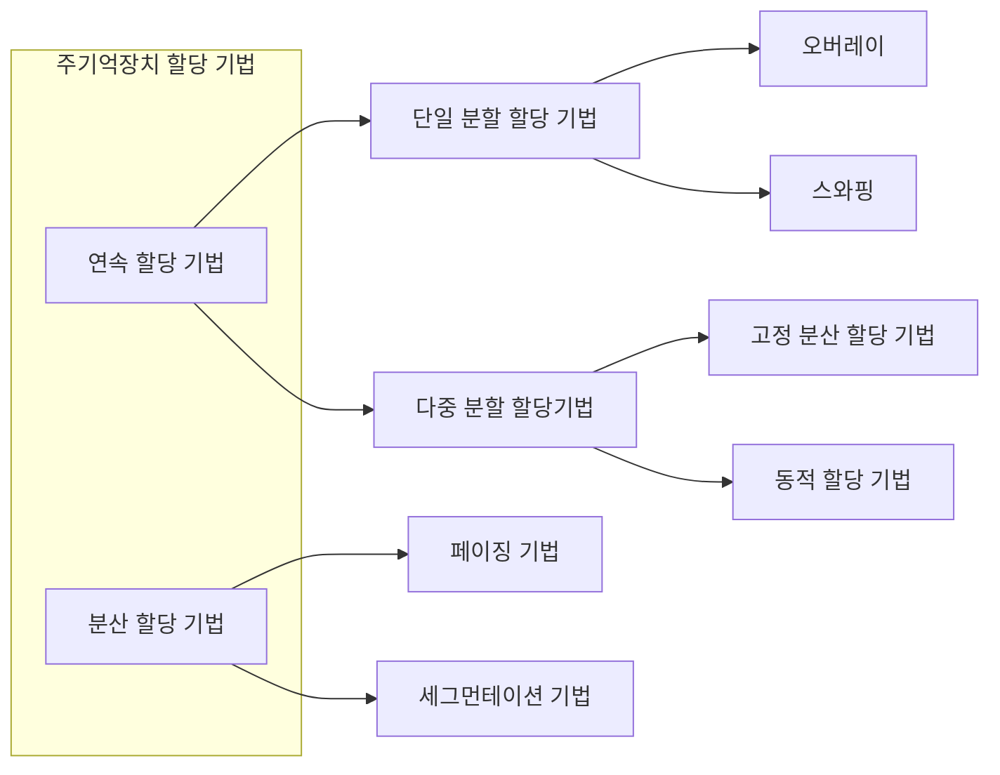
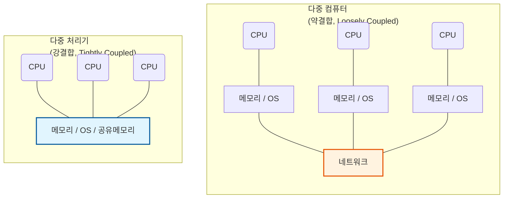

# 운영체제 개론

## 운영체제의 개요

### 정의

시스템의 자원들을 효율적으로 관리하며, 사용자가 효과적으로 사용할 수 있도록 환경을 제공하는 프로그램의 모음

컴퓨터와 사용자 간의 인터페이스로서 동작하는 시스템 소프트웨어의 일종, 타 응용 프로그램의 유용한 작업을 위한 환경을 제공

### 목적

처리 능력, 신뢰도, 사용 가능도 향상, 반환 시간 단축

### 성능 평가 기준

- 처리 능력 (Throughput)
    - 일정 시간내에 시스템이 처리하는 일의 양
- 반환 시간 (Turn Around Time)
    - 작업을 의뢰한 시간부터 처리 완료까지 걸린 시간
- 사용 가능도 (Availability)
    - 시스템을 사용할 필요가 있을 때 즉시 사용 가능한 정도
- 신뢰도 (Reliability)
    - 시스템이 문제를 정확하게 해결하는 정도

### 기능

- 프로세서 (처리기), 기억장치 (주/보조 기억장치), I/O 장치, 파일 및 정보 등의 자원을 관리
- 자원을 효율적으로 관리하기 위한 자원의 스케줄링 기능을 제공
- 사용자와 시스템 간의 편리한 인터페이스 제공
- 시스템의 각종 하드웨어와 네트워크를 관리및 제어
- 데이터를 관리하며 데이터 및 자원이 공유 기능을 제공
- 시스템의 오류를 검사 및 복구
- 입·출력에 대한 보조 기능을 제공
- 가상 계산기 기능 제공

## 운영체제 운용 기법

- 일괄 처리(Batch) 시스템
    - 초기의 컴퓨터 시스템에서 사용된 형태
    - 일정량/일정 기간 동안 데이터를 모아서 한꺼번에 처리
    - 급여 계산, 지불 계산, 연말 결산 등의 업무에 사용 가능
- 실시간 처리(Real Time Processing) 시스템
    - 데이터 발생 즉시, 또는 데이터 처리 요구 발생 즉시 처리하여 결과를 산출하는 방식
    - 시간에 제한을 두고 수행되어야 하는 작업에 사용
- 다중 프로그래밍(Multi-Programming) 시스템
    - 하나의 CPU와 주기억 장치를 이용하여 여러 프로그램을 동시에 처리하는 방법
    - 하나의 메인메모리에 복수의 프로그램을 기억시켜 두고 하나의 CPU와 통신하면서 처리
- 시분할 시스템
    - 복수의 사용자가 사용하는 시스템에서 컴퓨터에서 사용자들의 프로그램을 번갈아 가며 처리함으로써 각 사용자에게 독립된 컴퓨터를 사용하는 느낌을 주는 방식
    - 라운드 로빈(Round Robin)으로도 불린다.
    - 다중 프로그래밍 방식과 결합하여 모든 작업이 동시에 진행되는 것처럼 대화식 처리가 가능
- 다중 처리(Multi-Processing) 시스템
    - 복수의 CPU와 하나의 메인메모리를 사용하여 복수의 프로그램을 동시에 처리
    - CPU 하나가 고장나도 다른 CPU를 이용하여 업무처리 가능 → 시스템의 신뢰성, 안정성 높음
- 다중 모드 처리(Multi-Mode Processing
    - 일괄 처리 시스템, 시분할 시스템, 다중 처리 시스템, 실시간 처리 시스템을 한 시스템에서 모두 제공
- 분산 처리(Distributed Processing)
    - 복수의 컴퓨터(프로세서)를 통신 회선으로 연결하여 하나의 작업을 처리하는 방식
    - 각 단말장치나 컴퓨터 시스템은 고유의 OS와 CPU, 메모리를 가짐

### 운영체제 운용 기법의 발달 과정

1세대

- 일괄처리 시스템

2세대

- 다중 프로그래밍 시스템
- 다중 처리 시스템
- 시분할 시스템
- 실시간 처리 시스템

3세대

- 다중모드

4세대

- 분산 처리 시스템

## 프로세스 관리

### 프로세스

프로세서(처리기 , CPU)에 의해 처리되는 사용자 프로그램

시스템 프로그램, 즉 실행중인 프로그램을 의미. a.k.a. 작업(Job), 테스크(Task)

프로세스의 다양한 정의

- PCB를 가진 프로그램
    - PCB(프로세스 제어 블록): OS가 프로세스 처리와 관련된 중요한 데이터를 저장한 블록
- 메인메모리에 저장된 프로그램
- 프로세서가 할당되는 실체로서, 디스패치가 가능한 단위
    - 디스패치: 준비 상태에서 실행 상태로 상태 전이되는 과정
- 프로시저가 활동중인 것
    - 프로시저: 어떤 작업을 수행하기 위한 일련의 절차나 명령문들의 집합
- 비동기적 행위를 일으키는 주체
    - 비동기적 행위: 현재 작업의 완료를 기다리지 않고 다음 작업을 동시에 수행하거나 독립적으로 처리되도록 하는 방식
- 지정된 결과를 얻기 위한 일련의 계통적 동작
- 목적이나 결과에 따라 발생되는 사건들의 과정
- OS가 관리하는 실행 단위

### 프로세스 상태 전이

프로세스가 시스템 내에 존재하는 동안 프로세스의 상태가 변하는 것을 의미

프로세스의 상태를 상태 전이도로 표현 가능

프로세스의 상태는 제출, 접수, 준비, 실행, 대기 상태로 구분 가능 → 주요 세 가지 상태(메인메모리에서 이루어지는 상태)는 준비, 실행, 대기 상태

### 프로세스 상태 정의

| **상태명** | **정의** |
| --- | --- |
| **제출 (Submit)** | 작업을 처리하기 위해 사용자가 작업을 시스템에 입력한 초기 단계. |
| **접수 (Hold)** | 제출된 작업이 디스크 내의 스풀 공간에 저장되어 대기하는 상태. |
| **준비 (Ready)** | 프로세스가 CPU를 할당받기 위해 주 기억장치에서 대기 중인 상태.
프로세스는 준비상태 큐에서 실행을 준비.
접수 상태에서 준비 상태로의 전이는 Job 스케줄러에 의해 수행. |
| **실행 (Run)** | 프로세스가 CPU를 점유하여 실제 연산을 수행하고 있는 상태.
선점, 시간 초과 발생 시 프로세스는 준비 상태로 전이
실행 중인 프로세스에 입출력 처리 필요 시 실행 중인 프로세스는 대기 상태로 전이
준비 상태에서 실행 상태로의 전이는 CPU(프로세서) 스케줄러에 의해 수행 |
| **대기 (Wait, Block)** | 입·출력 발생 등으로 인해 외부 이벤트가 완료될 때까지 현재 실행중인 프로세스의 실행을 일시 중단(대기)한 상태. |
| **종료 (Terminated, Exit)** | 프로세스 실행이 완료되어 모든 자원을 반납하고 시스템에서 제거된 상태. |

### 프로세스 상태 전이 정의

| **전이 명칭** | **정의** |
| --- | --- |
| **Spooling** | 접수(Hold) 상태와 디스크 사이에서 데이터를 주고받으며 작업을 저장 및 관리하는 과정. |
| **Job 스케줄러** | 접수 상태에 있는 작업 중 실행할 작업을 선택하여 준비(Ready) 상태로 이동시키는 상위 단계 스케줄링. |
| **Dispatch** | 준비 상태에 있는 프로세스 중 하나를 선택하여 CPU를 할당하고 실행(Run) 상태로 전환하는 과정. |
| **선점, 시간 초과** | 실행 중인 프로세스가 할당된 시간(Time Slice)을 모두 소모하거나 높은 우선순위의 프로세스에 의해 CPU 점유권을 반납하고 준비 상태로 회귀하는 과정. |
| **입·출력 발생** | 실행 중인 프로세스가 I/O 작업 등 외부 이벤트의 처리를 요청하며 CPU를 반납하고 대기(Wait, Block) 상태로 전환하는 과정. |
| **입·출력 종료 / 깨움 (Wake Up)** | 대기 상태의 프로세스가 요청한 이벤트(I/O 완료 등)가 종료되어 다시 실행 기회를 얻기 위해 준비 상태로 전환되는 과정. |

## 스레드

프로세스 내에서의 작업 단위. 시스템의 여러 자원을 할당받아 실행한 프로그램의 단위

- 하나의 프로세스에 하나의 스레드가 존재하면 단일 스레드, 복수의 스레드가 존재하면 다중 스레드
- 프로세스의 일부 특성을 가져 경량 프로세스라고도 불림
- 스레드 기반 시스템에서 스레드는 독립적인 스케쥴링의 최소단위로서 프로세스의 역할을 대체
- 동일 프로세스 환경에서 서로 독립적인 다중 수행이 가능
- 스레드의 분류

| **구분** | **주요 특징 및 정의** |
| --- | --- |
| **사용자 수준의 스레드** | - 사용자가 만든 라이브러리를 사용하여 스레드를 운용함. 
- 커널 모드로의 전환이 없어 오버헤드가 줄어듦. 
- 속도는 빠르지만 구현이 어렵다. |
| **커널 수준의 스레드** | - 운영체제의 커널에 의해 스레드를 운용함. 
- 한 프로세스가 운영체제를 호출할 때 전체 프로세스가 대기하지 않으므로 시스템의 성능을 높일 수 있음. 
- 여러 스레드가 커널에 동시에 접근할 수 있음. 
- 스레드의 독립적인 스케줄링이 가능함. 
- 구현이 쉽지만 속도가 느림. |

## 프로세스 스케줄링

프로세스가 생성되어 실행될 때 필요한 시스템의 여러 자원을 해당 프로세스에게 할당하는 작업 

프로세스가 생성되어 완료될 때까지 프로세스는 여러 종류의 스케줄링 과정을 경유

스케줄링이 종류로는 장기 스케줄링, 중기 스케줄링, 단기 스케줄링이 있다.

| **종류** | **정의 및 특징** |
| --- | --- |
| **장기 스케줄링** | - 어떤 프로세스가 시스템의 자원을 차지할 수 있도록 할 것인가를 결정하여 준비상태 큐로 보내는 작업을 의미함. 
- 작업 스케줄링(Job Scheduling), 상위 스케줄링이라고도 하며, 작업 스케줄러에 의해 수행됨. |
| **중기 스케줄링** | - 어떤 프로세스들이 CPU를 할당받을 것인지 결정하는 작업을 의미함. 
- CPU를 할당받으려는 프로세스가 많을 경우 프로세스를 일시 보류시킨 후 활성화해서 일시적으로 부하를 조절함. |
| **단기 스케줄링** | - 프로세스가 실행되기 위해 CPU를 할당받는 시기와 특정 프로세스를 지정하는 작업을 의미함. 
- 프로세서 스케줄링(Processor Scheduling), 하위 스케줄링이라고도 함. 
- 프로세서 스케줄링 및 문맥 교환은 프로세서 스케줄러에 의해 수행됨. |

### 프로세스 스케줄링의 기법

비선점(Non-Preemptive) 스케줄링

- 이미 할당된 CPU를 다른 프로세스가 강제로 빼앗아 사용할 수 없는 스케줄링 기법
- 프로세스가 CPU를 할당받으면 해당 프로세스가 완료될 때까지 CPU를 사용
- 모든 프로세스에 대한 요구를 공정하게 처리 가능
- 프로세스 응답 시간의 예측 용이, 일괄 처리 방식에 적합
- 중요한 작업(짧은 작업)이 중요하지 않은 작업(긴 작업)을 기다리는 경우 발생 가능
- FCFS(FIFO), SJF, 우선순위, HRN, 기한부 등의 알고리즘

선점(Preemptive) 스케줄링 

- 하나의 프로세스가 CPU를 할당받아 실행하는 중 우신순위가  높은 다른 프로세스가 CPU를 강제로 빼앗아 사용 가능한 스케줄링 기법
- 우선순위가 높은 프로세스의 빠른 처리 가능
- 빠른 응답시간이 요구되는 대화식 시분할 시스템에 사용
- 많은 오버헤드(Overhead) 초래
    - 오버헤드 : 시스템이 사용자의 실제 작업을 처리하는 시간 외 시스템 자체의 운영/관리를 위해 부가적으로 소모되는 시간, 메모리, 자원
- 선점이 가능하도록 일정 시간 배당에 대한 인터럽트용 클록(Clock)이 필요
- Round Robin, SRT, 선점 우선순위, 다단계 큐, 다단계 피드백 큐 등의 알고리즘

### 주요 스케줄링 기법

실행 시간: 프로세스가 실제로 실행되는데 필요한 시간

대기 시간: 프로세스가 대기한 시간. 직전의 프로세스까지의 진행 시간으로 계산

반환 시간: 프로세스 처리 요청으로부터 실제 처리되기까지 걸린 시간. 대기 시간 + 실행 시간

실행 시간, 대기 시간, 반환 시간의 평균은 각 프로세스 시간의 합 / 프로세스의 개수

## 병행 프로세스와 상호 배재

### 병행 프로세스 (Concurrent Process)

두 개 이상의 프로세스들이 동시에 존재하며 실행상태에 있는 것을 의미

한정된 자원을 공유하고, 동시에 작업을 수행하기 위해 사용

## 임계 구역 (Critical Section)

다중 프로그래밍 운영체제에서 여러 프로세스가 공유하는 데이터 및 자원에 대하여 어느 한 시점에서는 하나의 프로세스만 자원 또는 데이터를 사용하도록 지정된 공유 자원(영역)을 의미

- 임계 구역에는 하나의 프로세스만 접근 가능하며 해당 프로세스가 자원을 반납한 후에만 다른 프로세스가 자원이나 데이터 사용 가능
- 임계 구역의 문제를 해결하기 위해서는 상호 배제(Mutual Exclusion), 진행(Progress), 한계 대기(Bounded Waiting) 3가지 조건을 충족해야 한다.
    - 상호 배제 : 한 번에 하나의 프로세스만이 공유 자원을 사용할 수 있어야 한다.
    - 진행 : 임계 구역에 아무 것도 접근하지 않았다면 접근 가능
    - 한계 대기 : 하나의 프로세스가 임계 구역을 진입하기 위해 무한정 대기하지 않아야 한다.

### 동기화 기법(Synchronization)

상호 배제의 한 형태. 두 개 이상의 프로세스를 한 시점에 동시에 처리가 불가하므로 각 프로세스에 대한 처리 순서를 결정하는 것

- 세마포어 (Semaphore)
    - 신호기, 가발을 의미. 각 프로세스에 제어 신호를 전달하여 순서대로 작업을 수행하도록 하는 기법
    - P와 V라는 두 가지 연산에 의해 동기화를 유지시키고 상호 배제의 원리를 보장
- 모니터 (Monitor)
    - 동기화를 구현하기 위한 특수 프로그램 기법, 특정 공유 자원을 프로세스에게 할당하는 데 필요한 데이터와 이 데이터를 처리하는 프로시저로 구성
    - 자료 추상화와 정보은폐 개념을 기초로 하며 공유 자원을 할당하기 위한 병행성 구조로 구성
    - 모니터의 경계에서 상호 배제가 시행
    - 모니터에는 한순간에 하나의 프로세스만 진입하여 자원 사용 가능

## 교착 상태

상호 배제에 의해 발생하는 문제점, 복수의 프로세스들이 자원을 점유한 상태에서 서로 다른 프로세스가 점유하고 있는 자원을 요구하며 무한정 대기하는 현상

### 교착 상태의 필요 충분 조건

교착 상태가 발생하려면 4가지 조건이 종족되야 하며 이 네 가지 조건 중 하나라도 충족되지 않으면 교착 상태가 발생하지 않는다.

- 상호 배재 (Mutual Exclusion)
    - 한 번에 하나의 프로세스만이 공유 자원을 사용
- 점유와 대기 (Hold and Wait)
    - 최소한 하나의 자원을 공유하고 있으며 다른 프로세스에 할당되어 사용되고 있는 자원을 추가로 점유하기 위해 대기하는 프로세스가 존재
- 비선점 (Non-preemption)
    - 다른 프로세스에 할당된 자원은 사용이 끝날 때까지 강제로 빼앗을 수 없음
- 환형 대기 (Circular Wait)
    - 공유 자원과 이를 사용하기 위해 대기하는 프로세스들이 원형으로 구성되어 있어 자신에게 할당된 자원을 점유하며 앞이나 뒤의 프로세스의 자원을 요구하는 상태

### 교착 상태의 해결 방법

- 예방 기법 (Prevention)
    - 교착 상태가 발생하지 않도록 사건에 시스템을 제어하는 방법
    - 교착 상태 발생의 네 가지 조건 중 하나를 물리적으로 부정함으로써 수행
    - 자원의 낭비가 가장 심하며 시스템 제약이 엄격한 기법
- 회피 기법 (Avoidance)
    - 교착 상태가 발생할 가능성 자체를 배제하지는 않고 자원 요청 시 시스템의 상태를 검사하여 미래에 교착 상태가 발생할 가능성이 일는지 동적으로 판단하여 가능성이 있으면 요청을 거절
    - 주로 은행원 알고리즘(Banker's Algorithm)이 사용
    - 은행원 알고리즘(Banker's Algorithm) : 은행에서 고객에게 대출해줄 수 있는 자금의 범위를 초과하지 않도록 관리하는 방식에서 유래
        - 자원 요청이 들어왔을 때 시스템이 안전 상태에 머물 수 있는지 미리 시뮬레이션하여 판단하고 안전한 경우에만 자원을 할당
- 발견 기법 (Detection)
    - 시스템에 교착 상태가 발생했는지 점검하여 교착 상태에 있는 프로세스와 자원을 발견하는 것
    - 교착 상태 발견 알고리즘과 자원 할당 그래프등을 사용 가능
- 회복 기법 (Recovery)
    - 교착 상태를 일으킨 프로세스를 종료하거나 교착 상태의 프로세스에 할당된 자원을 선점하여 프로세스나 자원을 회복

## 기억장치 관리

보조기억장치 내의 프로그램이나 데이터를 주기억장치에 적대시키는 시기, 적재 위치, 배치 위치, 교체 등을 지정하여 한정된 주기억장치의 공간을 효율적을 사용하기 위한 기법

- 반입 (Fatch) 전략 : 보조기억장치에 보관중인 프로그램이나 데이터를 언제 주기억장치에 적재할지를 결정하는 전략
    - 요구 반입 (Demand Fatch) : 실행중인 프로그램이 특정 프로그램이나 데이터 등의 참조 요구 시에 적재
    - 예상 반입 (Anticipatory Fetch) : 실행중인 프로그램에 의해 참조될 프로그램이나 데이터를 미리 예상하여 적재
- 배치 (Placement) 전략 : 새로 반입되는 프로그램이나 데이터를 주기억장치에 적재시킬 위치를 결정
    - 최초 적합 (First Fit) : 프로그램이나 데이터가 들어갈 수 있는 크기의 분할 영역을 찾으면 바로 적재
    - 최적 적합 (Best Fit) : 프로그램이나 데이터가 들어갈 수 있는 크기의 빈 영역 중 단편화를 가장 적게 남기는 분할 영역(용량이 가장 작은 영역)에 배치
    - 최악 적합 (Worst Fit) : 프로그램이나 데이터가 들어갈 수 있는 크기의 빈 영역 중 단편화를 가장 많이 남기는 분할 영역(용량이 가장 큰 영역)에 배치
- 교체 (Replacement) 전략 : 주기억장치의 모든 영역이 사용중인 상태에서 새로운 프로그램이나 데이터를 추가배치할 때, 이미 사용되고 있는 영역 중 어느 영역을 교체하여 사용할지를 결정
- FIFO, OPT, LRU, LFU, NUR, SCR 등

## 가상 기억장치

### 프로세스를 주기억장치에 할당하는 기법

### 가상기억장치

보조기억장치의 일부를 주기억장치처럼 사용하는 방법

- 프로그램을 여러 작은 블록 단위로 분해하여 가상기억장치에 보관.  프로그램 실행 시 요구되는 블록만 주기억장치에  불연속적으로 할당하여 처리
- 주기억장치의 용량보다 큰 프로그램의 실행을 위해 사용
- 주기억장치의 이용률과 다중 프로그래밍의 효율 향상
- 가상기억장치에 저장된 프로그램을 실행하려면 가상기억장치의 주소를 주기억장치의 주소로 바꾸는 주소 변환 작업 필요
    - 주소 사상 또는 주소 매핑 (Mapping)
- 블록 단위로 나누어 사용하므로 연속 할당 방식에서 발생할 수 있는 단편화 해결
- 블록의 종류에 따라 페이징 기법과 세그먼테이션 기법으로 구분

### 페이징(Paging) 기법

가상기억장치에 보관되어 있는 프로그램과 주기억장치의 영역을 동일한 크기로 나눈 후 분할된 프로그램을 동일한 크기로 나눠진 주기억장치의 영역에 적재시켜 실행하는 기법

- 프로그램을 나눈 일정한 크기의 단위를 페이지(Page)라 하고, 페이지와 같은 크기로 나눠진 주기억장치의 단위를 페이지 프레임(Page Frame)이라 불림
- 외부 단편화는 발생하지 않으나 내부 단편화 발생 가능
- 주소 변환을 위해 페이지의 위치 정보를 가지고 있는 페이지 맵 테이블(Page Map Table) 필요
- 페이지 맵 테이블 사용으로 비용이 증가하며 처리 속도는 감소

### 세그먼테이션(Segmentation) 기법

가상기억장치에 보관되어 있는 프로그램을 다양한 크기의 논리적인 단위로 나눈 후 주기억장치에 적재시켜 실행시키는 기법

- 프로그램을 배열이나 함수 등과 같은 논리적인 크기로 나눈 단위를 세그먼트(Segment)라 하며 각 세그먼트는 고유한 이름과 크기를 가진다.
- 기억장치의 사용자 관점을 보존하는 기억장치 관리 기법
    - 프로그램의 논리적 구조가 메모리상에서 그대로 유지
- 기억공간 절약을 위해 사용
- 주소 변환을 위해서 세그먼트가 존재하는 위치 정보를가지고 있는 세그먼트 맵 테이블(Segment Map Table) 필요
- 세그먼트가 주기억장치에 적재 시 타 세그먼트에게 할당된 영역을 침범할 수 없으며 이를 위해 기억장치 보호키(Storage Protection key) 필요
- 내부 단편화는 발생하지 않으나 외부 단편화 발생 가능

### 세그먼테이션 기법의 일반적인 주소 변환

주소 형식에 따른 주소와 세그먼트 맵 테이블의 구성

- 가상주소 형식
    - 가상주소는 세그먼트 번호를 나타내는 s와 세그먼트 내에 실제 내용이 위치하고 있는 곳까지의 거리를 나타내는 변위값 d로 구성
    - 세그먼트 번호(s) I 변위값(d)
- 실기억주소 형식
    - 완전주소 형태를 사용하며 이는 세그먼트의 기준번지와 변위값을 더함으로써 도출
    - 실기억주소(세그먼트 기준번지 + 변위값)
- 세그먼트 맵 테이블
    - 세그먼트 번호 s와 세그먼트의 크기 L(한계 번지), 주기억장치 상의 기준번지(시작주소) b로 구성
    - 세그먼트 번호(s) I 세그먼트 크기(L) ㅣ 기준번지(b)

### 페이지 교체 알고리즘

페이지 부재(Page Fault) 발생 시 가상기억장치에서 필요한 페이지를 찾아 주기억장치에 적재해야 한다.

이 때 주기억장치의 모든 페이지 프레임 사용중이면 어떤 페이지 프레임을 선택하여 교체할 것인지를 결정하는 기법

OPT, FIFO, LRU, NUR, SCR 등

**OPT (Optimal replacement, 최적 교체)**

- 미래에 가장 오랫동안 사용하지 않을 페이지를 교체한 기법
- 페이지 부재 횟수가 가상 적게 발생하는 가장 효율적인 알고리즘

**FIFO (선입선출)**

- 각 페이지가 주기억장치에 적재될 때마다 그때의 시간을 기록하여 가장 먼저 들어와 가장 오래 와 있었던 페이지를 교체하는 기법
- 이해하기 쉽고 설계 및 구현 간단

**LRU (Least Recently Used)**

- 최근에 가장 오랫동안 사용하지 않은 페이지를 교체하는 기법
- 각 페이지마다 계수기(Counter)나 스택(Stack)을 두어 현시점에서 가장 오랫동안 사용하지 않은, 즉 가장 오래전에 사용된 페이지를 교체

**LFU (Least Frequently Used)** 

- 사용 빈도가 가장 작은 페이지를 교체
- 활발하게 사용되는 페이지는 사용횟수가 많아 교체되지 않고 사용됨

**NUR (Not Used Recently)**

- 최근에 사용되지 않은 페이지를 교체
- 최근에 사용되지 않은 페이지는 향후에도 사용되지 않을 가능성 높음 → LRU에서 발생하는 시간적인 오버헤드 감축
- 최근 사용 여부 확인을 위해 각 페이지마다 참조 비트(Reference Bit)와 변형 비트(Modified Bit, Dirty Bit) 사용
- 비트 값에 따른 페이지 교체 우선순위

| 참조 비트 | 0 | 0 | 1 | 1 |
| --- | --- | --- | --- | --- |
| 변형 비트 | 0 | 1 | 0 | 1 |
| 교체 순서 | 1 | 2 | 3 | 4 |

**SCR (Second Shance Replacement, 2차 기회 교체)**

- 가장 오랫동안 주기억장치에 있던 페이지 중 자주 사용되는 페이지의 교체를 방지
- FIFO 기법의 단점을 보완

## 디스크 스케줄링

사용할 데이터가 디스크 상의 여러 군데에 저장되어 있을 경우 데이터 액세스를 위해 디스크 헤드의 이동 경로를 결정하는 방법

FCFS, SSTF, SCAN, C-SCAN, N-step SCAN, 에센바흐, SLTF 스케줄링 기법 등

**FCFS (First Come First Service) = FIFO**

가장 간단한 스케줄링 기법, 디스크 대기 큐에 가장 먼저 들어온 트랙에 대한 요청을 가장 먼저 서비스하는 기법

- 디스크 대기 큐에 있는 트랙 순서대로 디스크 헤드를 이동
- 순차적으로 서비스하기에 더 높은 우선순위의 요청이 입력되도 순서가 바뀌지 않아 공평성이 보장
- 디스크 오버헤드가 적을 때 효율적이며 프로그래밍이 쉬움
- 헤드 이동 거리가 길어질 수 있음.
- 디스크 오버헤드가 커지면 응답시간이 길어짐
- 탐색 시간 최적화 시도가 없는 기법

**SSTF (Shortest Seek Time First)**

탐색거리가 가장 짧은트랙에 대한 요청을 먼저 서비스하는 기법

- 현재 헤드 위치에서 가장 가까운 거리에 있는 트랙으로 헤드를 이동
- FCFS보다 처리량이 많고 평균 탐색 시간이 짧음
- 처리량이 많은 일괄 처리 시스템에 유용

## 파일 시스템

파일의 저장, 액세스, 공유, 보호 등 보조기억장치에서의 파일을 총괄하는 파일 관리 기술

### 기능 및 특징

- 사용자와 보조기억장치 사이에서 인터페이스 제공
- 사용자가 파일을 생성, 수정, 제거할 수 있도록 함
- 적절한 제어 방식을 통해 팀인의 파일을 공동으로 사용할 수 있도록 함
- 파일 공유를 위해 판독, 기록, 수행만 허용하거나 이들을 여러 형태로 조합하는 등 여러 종류의 액세스 제어 방법 제공
- 사용자가 적합한 구조로 파일을 구성할 수 있도록 함
- 불의의 사태를 대비하여 파일의 예비(Backup)와 복구(Recovery) 등의 기능 제공
- 사원에 물리적 이름 대신 기호환된 이름을 사용할 수 있음.
- 사용자가 파일을 편리하게 사용할 수 있도록 논리적 상태(디렉터리)를 보여줌
- 파일을 안전하게 사용할 수 있도록 하며 파일이 보호되어야 한다
- 파일의 정보가 손실되지 않도록 무결신을 유지

### 파일 디스크립터 File Descriptor, 파일 서술자)

파일을 관리하기 위한 시스템(운영체제)이 필요로 하는 파일에 대한 정보를 가진 제어 블록을 의미. a.k.a. 파일 제어 블록(FCB. File Control Block)

- 파일 디스크립터는 파일마다 독립적으로 존재하며 시스템에 따라 구조가 다를수 있다.
- 주로 보조기억장치 내에 저장되어 있으며 해당 파일이 Open 시 메인메모리에 적재
- 파일시스템이 관리하므로 사용자의 직접 참조x
- 디스크립터 내의 정보
    - 파일명 및 크기
    - 보조기억장치에서의 파일 위치
    - **파일 구조** : 순차 파일, 색인 순차 파일, 색인 파일 등
    - **보조기억장치의 유형** : 자기 디스크, 자기 테이프 등
    - 엑세스 제어 정보
    - **파일 유형** : 텍스트, 목적 프로그램 파일(2진 파일, 기계어 파일, 실행 파일) 등
    - 생성/최종 수정/제거 날짜와 시간
    - **액세스한 횟수** : 파일 사용 횟수

## 디렉터리의 구조

### 디렉터리

파일시스템 내부에 있으며 효율적인 파일 사용을 위해 디스크에 있는 파일에 대한 여러 정보를 가지고 있는 특수한 형태의 파일

### 디렉터리 구조의 종류

- 1단계 디렉터리
    - 가장 간단하고 모든 파일이 하나의 디렉터리 내에 위치하여 관리되는 구조
    - 모든 파일들이 유일한 이름을 가져야 함
- 2단계 디렉터리
    - 중앙에 마스터 파일 디렉터리가 있고 그 아래에 사용자별로 서로 다른 파일 디랙터리가 있는 2계층 구조
    - 마스터 파일 디렉터리는 사용자 파일 디렉터리를 관리하고 사용자 파일 디렉터리는 사용자별 파일을 관리
- 트리 디렉터리
    - 하나의 루트 디렉터리와 여러 개의 종속(서브) 디렉터리로 구성된 구조
    - DOS, Windows, UNIX 등의 운영체제에서 사용되는 디렉터리 구조
    - 포인터에 의해 계층적으로 디렉터리 탐색
- 비순환 그래프 디렉터리
    - 하위 파일이나 하위 디렉터리를 공통으로 사용할 수 있으며 사이클이 허용되지 않는다.
    - 공유된 파일을 삭제할 경우 고아 포인터(Dangling Pointer)가 발생 가능
- 일반적인 그래프 디렉터리
    - 트리 구조에 링크(Link)를 첨가시켜 순환을 허용하는 그래프 구조
    - 불필요한 파일을 제거하여 사용 공간을 늘리기 위한 참조 계수기 필요

## 자원 보호

컴퓨터 시스템에서 사용자, 프로세스 등과 같은 주체가 프로세스, CPU, 기억장치 등과 같은 객체(자원)에 비정상적으로 접근타는 것을 제어하고 객체(자원)의 물리적 손상을 예방하는 기법

접근 제어 행렬, 전역 테이블, 접근 제어 리스트, 권한(자격) 리스트 등의 기법 사용

- 주체 : 객체에 접근하는 것. 사용자, 프로세스 등을 의미
- 객체 : 정보를 가지고 있는 것. 디스크, 테이프, CPU, 기억장치, 자료 구조, 프로세스 등을 의미
- 접근 권한 : 주체가 객체에 접근할 수 있는 형태를 지정. 읽기 (r), 쓰기 (w), 실행(x)

**접근 제어 행렬**

- 자원 보호의 일반적 모델. 객체에 대한 접근 권한을 행렬로써 표시한 기법
- 행(Row)은 영역(사용자 프로세스), 열(Column)은 객체, 각 항은 접근 권한의 집합으로 구성

| 사용자/프로세스 | 파일 1 | 파일 2 | CPU |
| --- | --- | --- | --- |
| P1 | rw- | r-x | rw- |
| P2 | rwx | r-- | r-- |
| P3 | r-x | --- | rw- |

**전역 테이블 (Global Table)**

- 가장 간단한 구현 방법. 세 개의 순서쌍인 영역, 객체, 접근 권한의 집합을 목록 형태로 구성한 기법
- 테이블이 매우 커서 주기억장치에 저장할 수 없으므로 가상기억장치 기법을 사용해야 하며 주기억 장치에 저장될 경우 공간 낭비

| 영역 | 객체 | 접근 권한 |
| --- | --- | --- |
| P1 | 파일 1 | rw- |
| P1 | 파일 2 | r-x |
| P1 | CPU | rw- |
| P2 | 파일 1 | rwx |
| P2 | 파일 2 | r-- |
| P2 | CPU | r-- |
| P3 | 파일 1 | r-x |
| P3 | CPU | rw- |

**접근 제어 리스트 (Access Control List)**

- 접근 제어 행렬에 있는 각 열, 즉 객체를 중심으로 접근 리스트를 구성
- 각 객체에 대한 리스트는 영역, 접근 권한의 순서쌍으로 구성되며 각 객체에 대한 접근 권한을 가지는 모든 영역을 정의
- 접근 권한이 없는 영역은 제외

| 객체 | 접근 제어 리스트 |
| --- | --- |
| 파일 1 | (P1, 사용자, rw-), (P2, 사용자, rwx), (P3, 사용자, r-x) |
| 파일 2 | (P1, 사용자, r-x), (P2, 사용자, r--) |
| CPU | (P1, 사용자, rw-), (P2, 사용자, r--), (P3, 사용자, rw-) |

**권한(자격) 리스트** 

- 접근 제어 행렬의 각 행, 즉 영역을 중심으로 권한 리스트를 구성
- 각 영역에 대한 권한 리스트는 객체와 그 객체에 허용된 조각 리스트로 구성
- 권한 리스트는 영역과 결합되어 있지만 그 영역에서 수행중인 프로세스가 직접 접근할 수는 없다.
    - 권한 리스트는 운영체제에 의해 유지되며 사용자의 의해 간접적으로만 접근되는 보호된 객체

**P1**

| 파일 1 | rw- |
| --- | --- |
| 파일 2 | r-x |
| CPU | rw- |

**P2**

| 파일 1 | rwx |
| --- | --- |
| 파일 2 | r--  |
| CPU | r-- |

**P3**

| 파일 1 | r-x |
| --- | --- |
| CPU | rw- |

## 다중 처리기

하나의 시스템에 복수의 처리기(프로세서)를 두어 하나의 작업을 각 처리기에게 수행하도록 하는 기술 및 시스템

- 다중 처리기는 프로세서 간 상호작용이 밀집한 강결합 시스템
- 여러 작업을 동시에 처리하여 실행 시간이 감소되고 전체 효율의 향상 가능
- 일반적으로 프로세서 간 상호 작용이 밀접한 강결합 시스템인 공유-기억장치 시스템을 의미
- 다중 처리기의 운영체제 구조는 Master/Slave 처리기, 분리 실행 처리기, 대칭적 처리기로 분류

### Master/Slaver(주/종) 처리기

하나의 프로세서를 Master(주 프로세서)로 지정하고 나머지들을 slavel(종 프로세서)로 지정하는 구조

- 주 프로세서가 고장나면 전체 시스템이 다운
- 주 프로세서만 입·출력을 수행하므로 비대칭적인 구조

**주 프로세서와 종 프로세서의 역할**

- 주 프로세서
    - 입·출력과 연산을 담당
    - 운영체제를 수행
- 종 프로세서
    - 연산만 담당
    - 입·출력 발생 시 주 프로세서에게 서비스를 요청
    - 사용자 프로그래밍만 담당

### 약결합/강결합 시스템

**약결합 시스템(Loosely Coupled) 시스템**

- 각 프로에서마다 독립된 메모리를 가진 시스템. a.k.a 분산 처리 시스템
- 둘 이상의 독립된 컴퓨터 시스템을 통신망(통신 링크)을 통하여 연결한 시스템
- 각 시스템마다 독립적인 운영체제 보유
- 각 시스템은 독립적으로 작동할 수 있고 필요한 경우 상호 통신 가능
- 프로세서 간 통신은 메시지 전달이나 원격 프로시저 호출을 통해 구현
- 각 시스템마다 독자적인 운영이 가능하므로 CPU 간 결합력이 약함

**강결합(Tightly Coupled) 시스템**

- 동일 운영체제 하에서 복수의 프로세스가 하나의 메모리를 공유하여 사용하는 시스템. a.k.a. 다중(병렬) 되리 시스템
- 하나의 운영체제가 하나의 프로세서와 시스템 하드웨어를 제어
- 프로세서 간 통신은 공유 메모리를 통해 이뤄진다.
- 하나의 메모리를 사용하므로 CPU 간 결합력이 강함

### 분산 처리 시스템

약결합 시스템으로서 독립적인 처리 능력을 가진 컴퓨터 시스템을 통신망으로 연결한 시스템

서로 다른 장소에 위치한 컴퓨터 시스템에 기능과 자원을 분산시켜 상호 협력할 수 있는 시스템

**설계 목적**

- 자원 공유
    - 각 시스템이 통신망을 통해 연결되어 있으므로 유용한 자원을 공유하여 사용
- 연산 속도 향상
    - 하나의 일을 여러 시스템에 분산시켜 처리함으로써 연산 속도 향상
- 신뢰도 향상
    - 여러 시스템 중 하나의 시스템에 오류 발생 시 타 시스템은 계속 작업 처리 가능
- 컴퓨터 통신
    - 물리적으로 멀리 떨어져 있어도 통신망을 통해 정보 교환 가능

**장·단점**

| **장점** | • 여러 사용자들 간에 통신이 용이
• 제한된 장치를 여러 지역의 사용자가 공유
• 여러 사용자들이 데이터를 공유
• 중앙 컴퓨터의 과부하 감소 
• 사용자는 각 컴퓨터의 위치를 몰라도 자원의 사용이 가능 
• 업무량의 증가에 따른 시스템의 점진적인 확장이 용이 
• 하나의 일을 여러 시스템이 처리함으로써 연산 속도, 신뢰도, 사용 가능도가 향상되고 결함 허용이 가능 |
| --- | --- |
| **단점** | • 중앙 집중형 시스템에 비해 소프트웨어 개발이 어렵다 
• 중앙 집중형 시스템에 비해 복잡한 보안 정책 
• 시스템 유지상 통일성을 잃기 쉽다 
• 시스템의 설계가 복잡하고, 데이터 처리 서비스의 질 저하 |

### 위상에 따른 분산 처리 시스템의 분류

**스타(Star)형 / 성형**

- 모든 사이트가 하나의 중앙 사이트에 Point-to-Point 형태로 연결되어 있고 그 외의 타 사이트와는 연결되어 있저 않은 구조
- 기본 비용은 사이트의 수에 비례하며 통신 비용은 작게 소요
- 간단한 구조, 용이한 보수 및 관리
- 중앙 사이트를 제외한 사이트의 고장이 타 사이트에 영향이 없지만 중앙 사이트 고장 시 모든 통신이 단절
- 사이트의 증가에 따라 통신 회선도 증가

**망형 - 완전 연결형 (Fully Connection)**

- 각 사이트들이 시스템 내의 다른 모든 사이트들과 직접 연결된 구조
- 사이트의 수가 n개이면 링크(연결) 수는 n(n-1)/2개
- 기본 비용은 높으나 통신 비용이 적으며 신뢰성이 높다

**망형 - 부분 연결형 (Partially Connection)**

- 시스템 내의 일부 사이트들 간에만 연결된 형태이며 직접 연결되지 않은 사이트는 다른 사이트를 통해 통신하는 구조
- 완전 연결형보다 기본 비용은 적고 통신 비용은 많이 소요되며 신뢰성은 낮다

**트리 (Tree) / 계층형 (Hierachy)**

- 분산 처리 시스템의 가장 대표적인 형태. 각 사이트들이 트리 형태로 연결된 구조
- 기본 비용은 부분 연결형보다 적게 소요되고 통신 비용은 트리의 깊이에 비례
- 부모(상위) 사이트의 자식(하위) 사이트들은 부모 사이트를 통해 통신
- 부모 사이트 고장 시 그 자식 사이트들은 통신 불가능

**링 (Ring) 형 / 환형**

- 시스템 내의 각 사이트가 인접하는 다른 두 사이트와만 직접 연결된 구조
- 정보는 단방향 또는 양방향 전달 가능
- 기본 비용은 사이트 수에 비례
- 목적 사이트에 데이터를 전달하기 위해 링을 순한하면 통신 비용 증가

**다중 접근 버스 연결형 (Multi Access Bus Connection)**

- 시스템 내의 모든 사이트들이 공유 버스에 연결된 구조
- 기본 비용은 사이트 수에 비례, 통신 비용은 일반적으로 저렴함
- 사이트의 고장은 타 사이트의 통신에 영향을 주지는 않으나 버스의 고장은 전체 시스템에 영향을 미침
- 단순한 물리적 구조, 사이트의 추가/삭제 용이
- 통신 회선 길이에 제한
